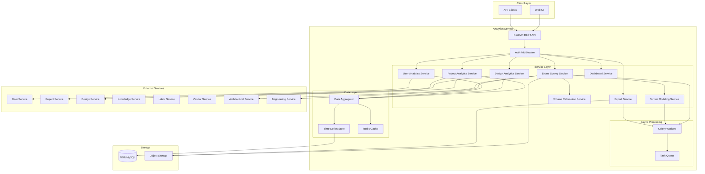

# Design Document: Analytics Service

## Overview

The Analytics Service is a comprehensive data analytics and business intelligence platform for DesignSynapse. It aggregates data from all platform services, processes drone survey data for site analysis, and provides real-time analytics, dashboards, and reporting capabilities. The service follows a layered architecture with async processing for computationally intensive operations like drone imagery analysis and 3D terrain modeling.

### Key Features

- **Multi-Service Integration**: Aggregates data from User, Project, Design, Knowledge, Labor, Vendor, Architectural, and Engineering services
- **Drone Survey Analytics**: Processes aerial imagery, generates 3D terrain models, calculates volumes, and monitors construction progress
- **Real-Time Processing**: Sub-5-second latency for metric updates using event-driven architecture
- **Business Intelligence**: Configurable dashboards with multiple export formats (PDF, Excel, CSV)
- **Async Task Processing**: Celery-based workers for long-running operations
- **TDD Approach**: Comprehensive test coverage with property-based testing for critical algorithms

## Architecture

### System Architecture



### Data Flow Patterns

1. **Real-Time Analytics Flow**:
   - Service events → Event bus → Analytics aggregator → Time series DB → Dashboard updates
   - Latency target: < 5 seconds end-to-end

2. **Drone Survey Processing Flow**:
   - Upload imagery → S3 storage → Async task creation → Celery worker → Image processing → Point cloud generation → 3D model → Volume calculations → Results storage

3. **Report Generation Flow**:
   - Report request → Async task → Data aggregation → Format conversion (PDF/Excel/CSV) → S3 storage → Notification

## Components and Interfaces

### API Endpoints

#### Project Analytics Endpoints

```python
GET /api/v1/analytics/projects/{project_id}
  - Returns: ProjectAnalytics (timeline, budget, resources)
  - Query params: start_date, end_date, metrics[]

GET /api/v1/analytics/projects
  - Returns: List[ProjectSummary]
  - Query params: status, type, date_range, page, page_size

GET /api/v1/analytics/projects/{project_id}/timeline
  - Returns: TimelineAnalytics (planned vs actual, variance)

GET /api/v1/analytics/projects/{project_id}/budget
  - Returns: BudgetAnalytics (costs, budget, utilization)

GET /api/v1/analytics/projects/{project_id}/resources
  - Returns: ResourceAnalytics (allocation, utilization)
```

#### Design Analytics Endpoints

```python
GET /api/v1/analytics/designs/{design_id}
  - Returns: DesignAnalytics (iterations, changes, compliance)

GET /api/v1/analytics/designs/{design_id}/iterations
  - Returns: List[DesignIteration] (version history, changes)

GET /api/v1/analytics/designs/{design_id}/compliance
  - Returns: ComplianceMetrics (validation results, percentages)

GET /api/v1/analytics/designs/patterns
  - Returns: DesignPatterns (frequently used elements, trends)
```

#### Service Performance Endpoints

```python
GET /api/v1/analytics/performance/services
  - Returns: List[ServiceMetrics] (response times, error rates)

GET /api/v1/analytics/performance/services/{service_name}
  - Returns: ServicePerformance (detailed metrics, trends)

GET /api/v1/analytics/performance/endpoints
  - Returns: List[EndpointMetrics] (usage, latency)

GET /api/v1/analytics/performance/alerts
  - Returns: List[PerformanceAlert] (threshold violations)
```

#### User Activity Endpoints

```python
GET /api/v1/analytics/users/activity
  - Returns: UserActivityMetrics (DAU, WAU, MAU, engagement)

GET /api/v1/analytics/users/{user_id}/activity
  - Returns: UserActivity (sessions, features used, journey)

GET /api/v1/analytics/users/retention
  - Returns: RetentionMetrics (return rates, cohort analysis)

GET /api/v1/analytics/users/features
  - Returns: FeatureUsage (most/least used features)
```

#### Drone Survey Endpoints

```python
POST /api/v1/analytics/drone-surveys
  - Body: DroneSurveyCreate (project_id, imagery_files, metadata)
  - Returns: DroneSurvey (id, status, task_id)
  - Async: Triggers image processing task

GET /api/v1/analytics/drone-surveys/{survey_id}
  - Returns: DroneSurvey (status, results, models)

GET /api/v1/analytics/drone-surveys/{survey_id}/terrain-model
  -
