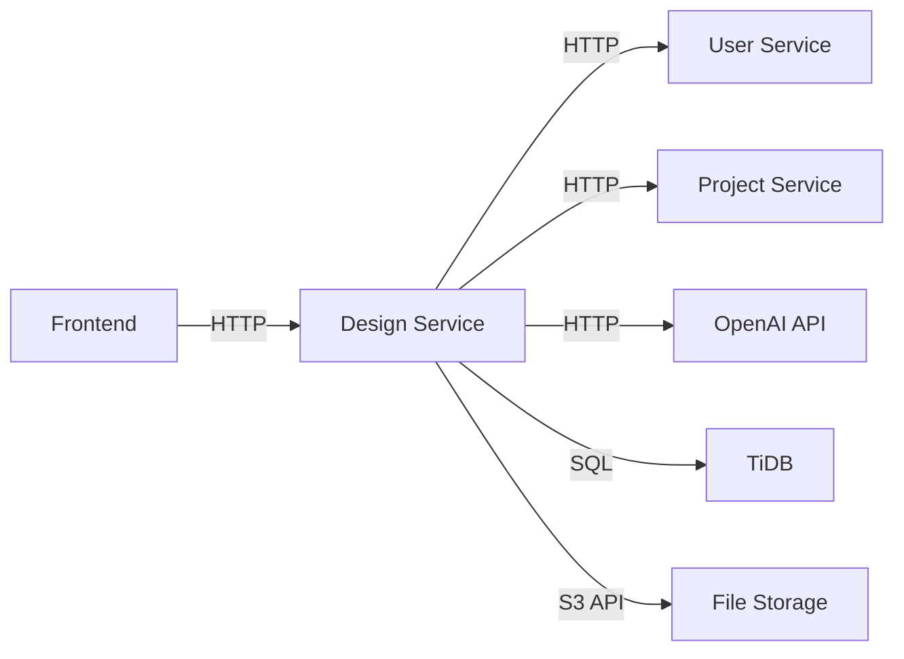

# Design Service Design Document

## Overview

The Design Service is a FastAPI-based microservice that provides AI-powered architectural design generation, validation, and optimization capabilities for the DesignSynapse platform. It integrates with OpenAI's GPT models for natural language processing and design generation, stores design data in TiDB, and communicates with other services (user-service, project-service) via HTTP APIs.

The service follows the established DesignSynapse architecture patterns:
- SQLAlchemy 2.0 with Mapped types for database models
- Pydantic v2 for request/response schemas
- Shared common packages for configuration, errors, and testing
- Test-driven development with comprehensive unit and integration tests
- Service boundary enforcement with no direct cross-service database access

## Architecture

### High-Level Architecture

```
┌─────────────────────────────────────────────────────────────┐
│                     Design Service API                       │
│                        (FastAPI)                             │
├─────────────────────────────────────────────────────────────┤
│  Design Routes  │  Validation  │  Optimization │  Export    │
├─────────────────────────────────────────────────────────────┤
│              Business Logic Layer                            │
│  ┌──────────────┐  ┌──────────────┐  ┌──────────────┐     │
│  │   Design     │  │  Validation  │  │ Optimization │     │
│  │   Generator  │  │   Engine     │  │   Engine     │     │
│  └──────────────┘  └──────────────┘  └──────────────┘     │
├─────────────────────────────────────────────────────────────┤
│              External Service Layer                          │
│  ┌──────────────┐  ┌──────────────┐  ┌──────────────┐     │
│  │   OpenAI     │  │    User      │  │   Project    │     │
│  │   Client     │  │   Service    │  │   Service    │     │
│  └──────────────┘  └──────────────┘  └──────────────┘     │
├─────────────────────────────────────────────────────────────┤
│              Data Access Layer                               │
│  ┌──────────────┐  ┌──────────────┐  ┌──────────────┐     │
│  │   Design     │  │  Validation  │  │    File      │     │
│  │ Repository   │  │  Repository  │  │   Storage    │     │
│  └──────────────┘  └──────────────┘  └──────────────┘     │
├─────────────────────────────────────────────────────────────┤
│                    TiDB Database                             │
│         (design_synapse_design_db)                          │
└─────────────────────────────────────────────────────────────┘
```

### Service Communication



## Components and Interfaces

### 1. Database Models

#### Design Model
```python
class Design(Base):
    """Main design entity storing architectural designs."""
    __tablename__ = "designs"

    id: Mapped[int] = mapped_column(Integer, primary_key=True)
    project_id: Mapped[int] = mapped_column(Integer, nullable=False, index=True)
    name: Mapped[str] = mapped_column(String(255), nullable=False)
    description: Mapped[Optional[str]] = mapped_column(Text, nullable=True)

    # Design specification (structured JSON)
    specification: Mapped[dict] = mapped_column(JSON, nullable=False)

    # Metadata
    building_type: Mapped[str] = mapped_column(String(100), nullable=False)  # residential, commercial, industrial
    total_area: Mapped[Optional[float]] = mapped_column(Float, nullable=True)  # in square meters
    num_floors: Mapped[Optional[int]] = mapped_column(Integer, nullable=True)
    materials: Mapped[Optional[List]] = mapped_column(JSON, nullable=True)

    # AI generation metadata
    generation_prompt: Mapped[Optional[str]] = mapped_column(Text, nullable=True)
    confidence_score: Mapped[Optional[float]] = mapped_column(Float, nullable=True)  # 0-100
    ai_model_version: Mapped[Optional[str]] = mapped_column(String(50), nullable=True)

    # Version control
    version: Mapped[int] = mapped_column(Integer, default=1, nullable=False)
    parent_design_id: Mapped[Optional[int]] = mapped_column(
        Integer,
        ForeignKey("designs.id"),
        nullable=True
    )

    # Status and compliance
    status: Mapped[str] = mapped_column(
        String(50),
        default="draft",
        nullable=False
    )  # draft, validated, compliant, non_compliant
    is_archived: Mapped[bool] = mapped_column(Boolean, default=False)

    # Audit fields
    created_by: Mapped[int] = mapped_column(Integer, nullable=False)
    created_at: Mapped[datetime] = mapped_column(DateTime, default=datetime.utcnow)
    updated_at: Mapped[datetime] = mapped_column(
        DateTime,
        default=datetime.utcnow,
        onupdate=datetime.utcnow
    )

    # Relationships
    validations: Mapped[List["DesignValidation"]] = relationship(
        "DesignValidation",
        back_populates="design",
        cascade="all, delete-orphan"
    )
    optimizations: Mapped[List["DesignOptimization"]] = relationship(
        "DesignOptimization",
        back_populates="design",
        cascade="all, delete-orphan"
    )
    files: Mapped[List["DesignFile"]] = relationship(
        "DesignFile",
        back_populates="design",
        cascade="all, delete-orphan"
    )
    comments: Mapped[List["DesignComment"]] = relationship(
        "DesignComment",
        back_populates="design",
        cascade="all, delete-orphan"
    )
    versions: Mapped[List["Design"]] = relationship(
        "Design",
        backref="parent_design",
        remote_side=[id]
    )
```

#### DesignValidation Model
```python
class DesignValidation(Base):
    """Validation results for designs against building codes."""
    __tablename__ = "design_validations"

    id: Mapped[int] = mapped_column(Integer, primary_key=True)
    design_id: Mapped[int] = mapped_column(
        Integer,
        ForeignKey("designs.id", ondelete="CASCADE"),
        nullable=False
    )

    # Validation metadata
    validation_type: Mapped[str] = mapped_column(String(100), nullable=False)  # building_code, structural, safety
    rule_set: Mapped[str] = mapped_column(String(100), nullable=False)  # e.g., "Kenya_Building_Code_2020"

    # Results
    is_compliant: Mapped[bool] = mapped_column(Boolean, nullable=False)
    violations: Mapped[List] = mapped_column(JSON, default=list)  # List of violation objects
    warnings: Mapped[List] = mapped_column(JSON, default=list)

    # Audit
    validated_at: Mapped[datetime] = mapped_column(DateTime, default=datetime.utcnow)
    validated_by: Mapped[int] = mapped_column(Integer, nullable=False)

    # Relationship
    design: Mapped["Design"] = relationship("Design", back_populates="validations")
```

#### DesignOptimization Model
```python
class DesignOptimization(Base):
    """AI-generated optimization suggestions for designs."""
    __tablename__ = "design_optimizations"

    id: Mapped[int] = mapped_column(Integer, primary_key=True)
    design_id: Mapped[int] = mapped_column(
        Integer,
        ForeignKey("designs.id", ondelete="CASCADE"),
        nullable=False
    )

    # Optimization details
    optimization_type: Mapped[str] = mapped_column(String(100), nullable=False)  # cost, structural, sustainability
    title: Mapped[str] = mapped_column(String(255), nullable=False)
    description: Mapped[str] = mapped_column(Text, nullable=False)

    # Impact analysis
    estimated_cost_impact: Mapped[Optional[float]] = mapped_column(Float, nullable=True)  # percentage
    implementation_difficulty: Mapped[str] = mapped_column(String(50), nullable=False)  # easy, medium, hard
    priority: Mapped[str] = mapped_column(String(50), default="medium")  # low, medium, high

    # Application status
    status: Mapped[str] = mapped_column(String(50), default="suggested")  # suggested, applied, rejected
    applied_at: Mapped[Optional[datetime]] = mapped_column(DateTime, nullable=True)
    applied_by: Mapped[Optional[int]] = mapped_column(Integer, nullable=True)

    # Audit
    created_at: Mapped[datetime] = mapped_column(DateTime, default=datetime.utcnow)

    # Relationship
    design: Mapped["Design"] = relationship("Design", back_populates="optimizations")
```

#### DesignFile Model
```python
class DesignFile(Base):
    """Files attached to designs (CAD, images, PDFs)."""
    __tablename__ = "design_files"

    id: Mapped[int] = mapped_column(Integer, primary_key=True)
    design_id: Mapped[int] = mapped_column(
        Integer,
        ForeignKey("designs.id", ondelete="CASCADE"),
        nullable=False
    )

    # File metadata
    filename: Mapped[str] = mapped_column(String(255), nullable=False)
    file_type: Mapped[str] = mapped_column(String(50), nullable=False)  # pdf, dwg, dxf, png, jpg, ifc
    file_size: Mapped[int] = mapped_column(Integer, nullable=False)  # bytes
    storage_path: Mapped[str] = mapped_column(String(500), nullable=False)

    # Optional description
    description: Mapped[Optional[str]] = mapped_column(Text, nullable=True)

    # Audit
    uploaded_by: Mapped[int] = mapped_column(Integer, nullable=False)
    uploaded_at: Mapped[datetime] = mapped_column(DateTime, default=datetime.utcnow)

    # Relationship
    design: Mapped["Design"] = relationship("Design", back_populates="files")
```

#### DesignComment Model
```python
class DesignComment(Base):
    """Comments and annotations on designs."""
    __tablename__ = "design_comments"

    id: Mapped[int] = mapped_column(Integer, primary_key=True)
    design_id: Mapped[int] = mapped_column(
        Integer,
        ForeignKey("designs.id", ondelete="CASCADE"),
        nullable=False
    )

    # Comment content
    content: Mapped[str] = mapped_column(Text, nullable=False)

    # Optional spatial positioning
    position_x: Mapped[Optional[float]] = mapped_column(Float, nullable=True)
    position_y: Mapped[Optional[float]] = mapped_column(Float, nullable=True)
    position_z: Mapped[Optional[float]] = mapped_column(Float, nullable=True)

    # Audit
    created_by: Mapped[int] = mapped_column(Integer, nullable=False)
    created_at: Mapped[datetime] = mapped_column(DateTime, default=datetime.utcnow)
    updated_at: Mapped[datetime] = mapped_column(
        DateTime,
        default=datetime.utcnow,
        onupdate=datetime.utcnow
    )
    is_edited: Mapped[bool] = mapped_column(Boolean, default=False)

    # Relationship
    design: Mapped["Design"] = relationship("Design", back_populates="comments")
```

### 2. Pydantic Schemas

#### Request Schemas
```python
class DesignGenerationRequest(BaseModel):
    """Request schema for AI design generation."""
    model_config = ConfigDict(from_attributes=True)

    project_id: int = Field(..., description="Project ID this design belongs to")
    name: str = Field(..., min_length=1, max_length=255)
    description: str = Field(..., description="Natural language design description")
    building_type: str = Field(..., description="Type of building")
    requirements: Dict[str, Any] = Field(default_factory=dict, description="Specific requirements")

class DesignUpdateRequest(BaseModel):
    """Request schema for updating a design."""
    model_config = ConfigDict(from_attributes=True)

    name: Optional[str] = Field(None, min_length=1, max_length=255)
    description: Optional[str] = None
    specification: Optional[Dict[str, Any]] = None
    status: Optional[str] = None

class ValidationRequest(BaseModel):
    """Request schema for design validation."""
    model_config = ConfigDict(from_attributes=True)

    validation_type: str = Field(..., description="Type of validation to perform")
    rule_set: str = Field(..., description="Building code rule set to use")

class OptimizationRequest(BaseModel):
    """Request schema for design optimization."""
    model_config = ConfigDict(from_attributes=True)

    optimization_types: List[str] = Field(
        default=["cost", "structural", "sustainability"],
        description="Types of optimizations to generate"
    )
```

#### Response Schemas
```python
class DesignResponse(BaseModel):
    """Response schema for design data."""
    model_config = ConfigDict(from_attributes=True)

    id: int
    project_id: int
    name: str
    description: Optional[str]
    specification: Dict[str, Any]
    building_type: str
    total_area: Optional[float]
    num_floors: Optional[int]
    materials: Optional[List[str]]
    confidence_score: Optional[float]
    version: int
    status: str
    created_by: int
    created_at: datetime
    updated_at: datetime

class ValidationResponse(BaseModel):
    """Response schema for validation results."""
    model_config = ConfigDict(from_attributes=True)

    id: int
    design_id: int
    validation_type: str
    rule_set: str
    is_compliant: bool
    violations: List[Dict[str, Any]]
    warnings: List[Dict[str, Any]]
    validated_at: datetime

class OptimizationResponse(BaseModel):
    """Response schema for optimization suggestions."""
    model_config = ConfigDict(from_attributes=True)

    id: int
    design_id: int
    optimization_type: str
    title: str
    description: str
    estimated_cost_impact: Optional[float]
    implementation_difficulty: str
    priority: str
    status: str
    created_at: datetime
```

### 3. Service Layer

#### DesignGeneratorService
```python
class DesignGeneratorService:
    """Service for AI-powered design generation."""

    def __init__(self, llm_client: LLMClient, design_repo: DesignRepository):
        self.llm_client = llm_client
        self.design_repo = design_repo

    async def generate_design(
        self,
        request: DesignGenerationRequest,
        user_id: int
    ) -> Design:
        """Generate a design from natural language description."""
        # 1. Validate project access via project-service
        # 2. Build AI prompt from request
        # 3. Call LLM to generate design specification
        # 4. Parse and validate LLM response
        # 5. Create Design entity with specification
        # 6. Save to database
        # 7. Return created design
        pass

    async def create_design_version(
        self,
        design_id: int,
        updates: Dict[str, Any],
        user_id: int
    ) -> Design:
        """Create a new version of an existing design."""
        pass
```

#### ValidationService
```python
class ValidationService:
    """Service for design validation against building codes."""

    def __init__(
        self,
        validation_repo: ValidationRepository,
        rule_engine: RuleEngine
    ):
        self.validation_repo = validation_repo
        self.rule_engine = rule_engine

    async def validate_design(
        self,
        design: Design,
        validation_type: str,
        rule_set: str,
        user_id: int
    ) -> DesignValidation:
        """Validate a design against specified rules."""
        # 1. Load rule set configuration
        # 2. Extract relevant design parameters
        # 3. Run validation rules
        # 4. Collect violations and warnings
        # 5. Create DesignValidation entity
        # 6. Update design status if needed
        # 7. Save and return validation result
        pass
```

#### OptimizationService
```python
class OptimizationService:
    """Service for AI-powered design optimization."""

    def __init__(
        self,
        llm_client: LLMClient,
        optimization_repo: OptimizationRepository
    ):
        self.llm_client = llm_client
        self.optimization_repo = optimization_repo

    async def generate_optimizations(
        self,
        design: Design,
        optimization_types: List[str]
    ) -> List[DesignOptimization]:
        """Generate optimization suggestions for a design."""
        # 1. Analyze design specification
        # 2. Build optimization prompt for LLM
        # 3. Call LLM for each optimization type
        # 4. Parse suggestions
        # 5. Create DesignOptimization entities
        # 6. Save and return optimizations
        pass

    async def apply_optimization(
        self,
        optimization_id: int,
        user_id: int
    ) -> Design:
        """Apply an optimization suggestion to create new design version."""
        pass
```

### 4. API Endpoints

```
POST   /api/v1/designs                    - Generate new design
GET    /api/v1/designs/{id}               - Get design by ID
PUT    /api/v1/designs/{id}               - Update design
DELETE /api/v1/designs/{id}               - Delete design
GET    /api/v1/designs                    - List designs (with filters)
GET    /api/v1/designs/{id}/versions      - Get design version history

POST   /api/v1/designs/{id}/validate      - Validate design
GET    /api/v1/designs/{id}/validations   - Get validation history

POST   /api/v1/designs/{id}/optimize      - Generate optimizations
GET    /api/v1/designs/{id}/optimizations - Get optimization suggestions
POST   /api/v1/optimizations/{id}/apply   - Apply optimization

POST   /api/v1/designs/{id}/files         - Upload file
GET    /api/v1/designs/{id}/files         - List files
DELETE /api/v1/files/{id}                 - Delete file
GET    /api/v1/files/{id}/download        - Download file

POST   /api/v1/designs/{id}/comments      - Add comment
GET    /api/v1/designs/{id}/comments      - List comments
PUT    /api/v1/comments/{id}              - Update comment
DELETE /api/v1/comments/{id}              - Delete comment

POST   /api/v1/designs/{id}/export        - Export design (JSON/PDF/IFC)

GET    /health                             - Health check
GET    /ready                              - Readiness check
```

## Data Models

### Design Specification JSON Structure
```json
{
  "building_info": {
    "type": "residential",
    "subtype": "single_family",
    "total_area": 250.5,
    "num_floors": 2,
    "height": 7.5
  },
  "structure": {
    "foundation_type": "slab",
    "wall_material": "concrete_block",
    "roof_type": "pitched",
    "roof_material": "clay_tiles"
  },
  "spaces": [
    {
      "name": "Living Room",
      "area": 35.0,
      "floor": 1,
      "dimensions": {"length": 7.0, "width": 5.0, "height": 3.0}
    }
  ],
  "materials": [
    {
      "name": "Concrete Blocks",
      "quantity": 5000,
      "unit": "pieces",
      "estimated_cost": 150000
    }
  ],
  "compliance": {
    "building_code": "Kenya_Building_Code_2020",
    "zoning": "residential_low_density",
    "setbacks": {"front": 5.0, "rear": 3.0, "side": 2.0}
  }
}
```

### Validation Violation Structure
```json
{
  "code": "SETBACK_VIOLATION",
  "severity": "critical",
  "rule": "Front setback must be at least 5 meters",
  "current_value": 4.5,
  "required_value": 5.0,
  "location": "front_boundary",
  "suggestion": "Increase front setback by 0.5 meters"
}
```

## Error Handling

The service uses the shared error handling infrastructure from `packages/common/errors`:

```python
from packages.common.errors import (
    DesignServiceError,
    DesignNotFoundError,
    ValidationError,
    AIGenerationError,
    register_error_handlers
)

# Custom exceptions
class DesignGenerationFailedError(DesignServiceError):
    """Raised when AI design generation fails."""
    pass

class InvalidDesignSpecificationError(ValidationError):
    """Raised when design specification is invalid."""
    pass

class BuildingCodeNotFoundError(DesignServiceError):
    """Raised when specified building code rule set doesn't exist."""
    pass
```

Error responses follow the standard format:
```json
{
  "error": {
    "type": "DESIGN_NOT_FOUND",
    "message": "Design with ID 123 not found",
    "details": {
      "design_id": 123
    },
    "timestamp": "2025-10-11T10:30:00Z"
  }
}
```

## Testing Strategy

### Unit Tests
- Model validation and constraints
- Service layer business logic
- Repository CRUD operations
- Schema validation
- Utility functions

### Integration Tests
- API endpoint testing with test database
- Service-to-service communication (mocked)
- Database transactions and rollbacks
- File upload/download flows
- AI client integration (mocked)

### Test Infrastructure
```python
# apps/design-service/tests/factories.py
class DesignFactory(BaseFactory):
    class Meta:
        model = Design

    name = factory.Faker("sentence", nb_words=3)
    project_id = 1
    building_type = "residential"
    specification = factory.LazyFunction(lambda: {"building_info": {}})
    created_by = 1

# apps/design-service/tests/conftest.py
@pytest.fixture
def design_service(db_session, mock_llm_client):
    repo = DesignRepository(db_session)
    return DesignGeneratorService(mock_llm_client, repo)

@pytest.fixture
def mock_llm_client():
    client = Mock(spec=LLMClient)
    client.generate.return_value = {"specification": {}}
    return client
```

### Test Coverage Goals
- Unit tests: 90%+ coverage
- Integration tests: 80%+ coverage
- Critical paths: 100% coverage (design generation, validation)

## Configuration

### Environment Variables
```bash
# Service Configuration
DESIGN_SERVICE_PORT=8004
DESIGN_SERVICE_HOST=0.0.0.0

# Database
DATABASE_HOST=gateway01.eu-central-1.prod.aws.tidbcloud.com
DATABASE_PORT=4000
DATABASE_USER=cluster_id.root
DATABASE_PASSWORD=secure_password
DATABASE_NAME=design_synapse_design_db
DATABASE_SSL_CA=./ca.pem

# AI/LLM Configuration
OPENAI_API_KEY=sk-...
OPENAI_MODEL=gpt-4
OPENAI_FALLBACK_MODEL=gpt-3.5-turbo
OPENAI_MAX_TOKENS=4000
OPENAI_TEMPERATURE=0.7

# Service URLs
USER_SERVICE_URL=http://localhost:8001
PROJECT_SERVICE_URL=http://localhost:8002

# File Storage
FILE_STORAGE_TYPE=local  # local or s3
FILE_STORAGE_PATH=./storage/designs
MAX_FILE_SIZE_MB=50

# Building Code Rules
BUILDING_CODE_RULES_PATH=./config/building_codes
DEFAULT_BUILDING_CODE=Kenya_Building_Code_2020
```

### Configuration Classes
```python
from packages.common.config import DatabaseConfig, LLMConfig
from pydantic_settings import BaseSettings

class DesignServiceConfig(BaseSettings):
    # Service
    service_name: str = "design-service"
    port: int = 8004
    host: str = "0.0.0.0"

    # Database
    database: DatabaseConfig

    # AI/LLM
    llm: LLMConfig

    # External Services
    user_service_url: str
    project_service_url: str

    # File Storage
    file_storage_type: str = "local"
    file_storage_path: str = "./storage/designs"
    max_file_size_mb: int = 50

    # Building Codes
    building_code_rules_path: str = "./config/building_codes"
    default_building_code: str = "Kenya_Building_Code_2020"

    class Config:
        env_file = ".env"
        env_nested_delimiter = "__"
```

## Security Considerations

1. **Authentication**: All endpoints require valid JWT token from user-service
2. **Authorization**: Project membership verified via project-service before design access
3. **Input Validation**: All user inputs validated with Pydantic schemas
4. **SQL Injection**: Prevented by SQLAlchemy ORM parameterized queries
5. **File Upload**: File type and size validation, virus scanning (future)
6. **API Rate Limiting**: Implement rate limiting for AI generation endpoints
7. **Data Encryption**: TLS for database connections, encrypted file storage

## Performance Considerations

1. **Database Indexing**: Indexes on project_id, created_by, status, building_type
2. **Connection Pooling**: SQLAlchemy pool size: 5-20 connections
3. **Caching**: Cache building code rules, frequently accessed designs
4. **Async Operations**: Use async/await for I/O operations
5. **Pagination**: Limit list endpoints to 50 items per page
6. **AI Request Optimization**: Batch similar requests, cache common prompts
7. **File Storage**: Use streaming for large file uploads/downloads

## Deployment

### Docker Configuration
```dockerfile
FROM python:3.13-slim

WORKDIR /app

COPY requirements.txt .
RUN pip install --no-cache-dir -r requirements.txt

COPY . .

CMD ["uvicorn", "main:app", "--host", "0.0.0.0", "--port", "8004"]
```

### Health Checks
```python
@app.get("/health")
async def health_check():
    return {
        "status": "healthy",
        "service": "design-service",
        "version": "1.0.0",
        "timestamp": datetime.utcnow().isoformat()
    }

@app.get("/ready")
async def readiness_check(db: Session = Depends(get_db)):
    # Check database connectivity
    # Check AI service availability
    # Return ready status
    pass
```

## Migration Strategy

### Database Migrations
- Use Alembic for schema migrations
- Initial migration creates all tables
- Version control all migration files
- Test migrations on staging before production

### Data Migration
- No existing data to migrate (new service)
- Future migrations will use Alembic data migration scripts

## Future Enhancements

1. **3D Visualization**: Integration with Three.js or similar for 3D rendering
2. **BIM Integration**: Import/export IFC files for BIM workflows
3. **Real-time Collaboration**: WebSocket support for collaborative design editing
4. **Advanced AI Models**: Fine-tuned models for African building standards
5. **Cost Estimation**: Detailed cost breakdown based on local material prices
6. **Sustainability Scoring**: Environmental impact analysis
7. **Mobile Support**: Responsive design for mobile devices
8. **Offline Mode**: Progressive Web App with offline capabilities
