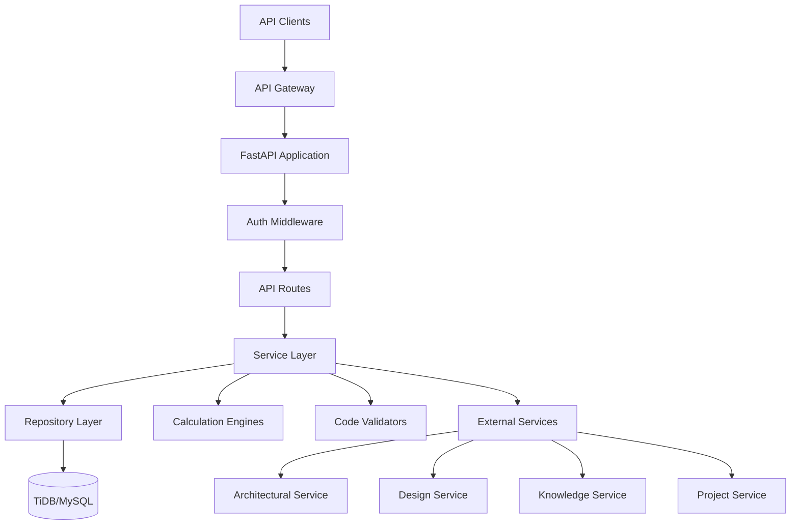

# Design Document: Engineering Service

## Overview

The Engineering Service is a FastAPI-based microservice that provides comprehensive engineering analysis, calculations, and design capabilities for structural, MEP, and civil engineering disciplines. It follows a layered architecture with clear separation between API, business logic, data access, and external integrations.

### Key Design Principles

- **Domain-Driven Design**: Organized around engineering disciplines (structural, MEP, civil)
- **Test-Driven Development**: Comprehensive unit and property-based testing
- **Async-First**: All I/O operations use async/await patterns
- **Service Integration**: Resilient integration with platform services
- **Code Compliance**: Built-in verification against engineering codes
- **Unit Flexibility**: Support for both Imperial and Metric systems

## Architecture

### High-Level Architecture




### Service Layers

1. **API Layer** (`src/api/v1/`)
   - FastAPI routes and endpoints
   - Request/response schemas (Pydantic v2)
   - Input validation and error handling
   - Authentication/authorization middleware

2. **Service Layer** (`src/services/`)
   - Business logic and orchestration
   - Calculation coordination
   - External service integration
   - Transaction management

3. **Calculation Layer** (`src/calculations/`)
   - Engineering calculation engines
   - Structural analysis algorithms
   - MEP system sizing
   - Civil engineering computations

4. **Repository Layer** (`src/repositories/`)
   - Data access abstraction
   - SQLAlchemy ORM operations
   - Query optimization
   - Transaction handling

5. **Integration Layer** (`src/integrations/`)
   - External service clients
   - Retry logic and circuit breakers
   - Response caching
   - Error handling

6. **Validation Layer** (`src/validators/`)
   - Code compliance checking
   - Input validation
   - Business rule enforcement
   - Unit conversion validation

## Components and Interfaces


### Core Components

#### 1. Structural Engineering Module

**StructuralCalculationService**
```python
class StructuralCalculationService:
    async def calculate_loads(
        self,
        building_data: BuildingData,
        load_types: List[LoadType]
    ) -> LoadCalculationResult:
        """Calculate structural loads per ASCE 7"""

    async def design_beam(
        self,
        loads: BeamLoads,
        span: float,
        material: MaterialProperties
    ) -> BeamDesignResult:
        """Design beam with deflection and stress checks"""

    async def design_column(
        self,
        axial_load: float,
        moment: float,
        length: float,
        material: MaterialProperties
    ) -> ColumnDesignResult:
        """Design column with buckling analysis"""

    async def design_foundation(
        self,
        loads: FoundationLoads,
        soil_properties: SoilProperties
    ) -> FoundationDesignResult:
        """Design foundation with bearing capacity check"""
```

**LoadCalculator**
```python
class LoadCalculator:
    def calculate_dead_load(self, components: List[Component]) -> float:
        """Sum dead loads from building components"""

    def calculate_live_load(self, occupancy: OccupancyType, area: float) -> float:
        """Calculate live load per ASCE 7 Table 4.3-1"""

    def calculate_wind_load(self, building: BuildingData, wind_speed: float) -> WindLoadResult:
        """Calculate wind loads per ASCE 7 Chapter 27"""

    def calculate_seismic_load(self, building: BuildingData, seismic_data: SeismicData) -> SeismicLoadResult:
        """Calculate seismic loads per ASCE 7 Chapter 12"""
```


#### 2. MEP Systems Module

**MEPCalculationService**
```python
class MEPCalculationService:
    async def design_hvac_system(
        self,
        building_data: BuildingData,
        climate_data: ClimateData
    ) -> HVACDesignResult:
        """Design HVAC system per ASHRAE standards"""

    async def design_electrical_system(
        self,
        loads: ElectricalLoads,
        voltage: float
    ) -> ElectricalDesignResult:
        """Design electrical distribution per NEC"""

    async def design_plumbing_system(
        self,
        fixtures: List[Fixture],
        supply_pressure: float
    ) -> PlumbingDesignResult:
        """Design plumbing system per IPC"""

    async def design_fire_protection(
        self,
        building_data: BuildingData,
        occupancy: OccupancyType
    ) -> FireProtectionResult:
        """Design fire protection per NFPA 13"""
```

**HVACCalculator**
```python
class HVACCalculator:
    def calculate_heating_load(self, building: BuildingData, climate: ClimateData) -> float:
        """Calculate heating load per ASHRAE Handbook"""

    def calculate_cooling_load(self, building: BuildingData, climate: ClimateData) -> float:
        """Calculate cooling load per ASHRAE Handbook"""

    def size_equipment(self, heating_load: float, cooling_load: float) -> EquipmentSize:
        """Size HVAC equipment based on loads"""
```

**ElectricalCalculator**
```python
class ElectricalCalculator:
    def calculate_load(self, circuits: List[Circuit]) -> float:
        """Calculate total electrical load"""

    def size_panel(self, load: float, voltage: float) -> PanelSize:
        """Size electrical panel per NEC"""

    def size_circuit(self, load: float, voltage: float, length: float) -> CircuitSize:
        """Size circuit conductors per NEC"""
```


#### 3. Civil Engineering Module

**CivilCalculationService**
```python
class CivilCalculationService:
    async def design_grading(
        self,
        site_data: SiteData,
        target_elevations: Dict[str, float]
    ) -> GradingDesignResult:
        """Design site grading with cut/fill analysis"""

    async def design_stormwater(
        self,
        site_data: SiteData,
        rainfall_data: RainfallData
    ) -> StormwaterDesignResult:
        """Design stormwater management system"""

    async def design_utilities(
        self,
        site_data: SiteData,
        utility_loads: UtilityLoads
    ) -> UtilityDesignResult:
        """Design utility connections"""
```

#### 4. Document Management

**DocumentService**
```python
class DocumentService:
    async def create_calculation_sheet(
        self,
        calculation_data: CalculationData,
        user_id: UUID
    ) -> CalculationSheet:
        """Create versioned calculation sheet"""

    async def update_calculation_sheet(
        self,
        sheet_id: UUID,
        updates: CalculationData,
        user_id: UUID
    ) -> CalculationSheet:
        """Update calculation sheet with version control"""

    async def get_document_history(
        self,
        document_id: UUID
    ) -> List[DocumentVersion]:
        """Retrieve document version history"""

    async def generate_specification(
        self,
        spec_data: SpecificationData
    ) -> TechnicalSpecification:
        """Generate CSI MasterFormat specification"""
```


#### 5. Code Compliance Validation

**CodeValidatorService**
```python
class CodeValidatorService:
    async def validate_structural_code(
        self,
        design: StructuralDesign,
        jurisdiction: str
    ) -> ComplianceReport:
        """Validate against IBC and ASCE 7"""

    async def validate_mep_code(
        self,
        design: MEPDesign,
        jurisdiction: str
    ) -> ComplianceReport:
        """Validate against NEC, IPC, IMC, NFPA"""

    async def validate_energy_code(
        self,
        design: BuildingDesign,
        jurisdiction: str
    ) -> ComplianceReport:
        """Validate against IECC and ASHRAE 90.1"""

    async def get_code_requirements(
        self,
        code_type: CodeType,
        jurisdiction: str
    ) -> CodeRequirements:
        """Retrieve code requirements from Knowledge Service"""
```

#### 6. Unit Conversion

**UnitConverter**
```python
class UnitConverter:
    def convert(self, value: float, from_unit: Unit, to_unit: Unit) -> float:
        """Convert between units with validation"""

    def to_imperial(self, value: float, metric_unit: Unit) -> Tuple[float, Unit]:
        """Convert metric to imperial"""

    def to_metric(self, value: float, imperial_unit: Unit) -> Tuple[float, Unit]:
        """Convert imperial to metric"""

    def format_value(self, value: float, unit: Unit, system: UnitSystem) -> str:
        """Format value with appropriate unit display"""
```


#### 7. External Service Integration

**ArchitecturalServiceClient**
```python
class ArchitecturalServiceClient:
    async def get_design(self, design_id: UUID) -> ArchitecturalDesign:
        """Retrieve architectural design"""

    async def get_space_requirements(self, project_id: UUID) -> List[SpaceRequirement]:
        """Get space requirements for MEP sizing"""

    async def subscribe_to_design_changes(
        self,
        design_id: UUID,
        callback: Callable
    ) -> None:
        """Subscribe to design change notifications"""
```

**DesignServiceClient**
```python
class DesignServiceClient:
    async def update_technical_requirements(
        self,
        design_id: UUID,
        requirements: TechnicalRequirements
    ) -> None:
        """Update technical drawing requirements"""

    async def get_drawings(self, project_id: UUID) -> List[Drawing]:
        """Retrieve technical drawings"""
```

**KnowledgeServiceClient**
```python
class KnowledgeServiceClient:
    async def get_code_standards(
        self,
        code_type: str,
        jurisdiction: str
    ) -> CodeStandards:
        """Retrieve engineering codes and standards"""

    async def search_formulas(self, query: str) -> List[EngineeringFormula]:
        """Search engineering formulas and references"""
```

**ProjectServiceClient**
```python
class ProjectServiceClient:
    async def update_milestone(
        self,
        project_id: UUID,
        milestone: EngineeringMilestone
    ) -> None:
        """Update engineering milestone status"""

    async def get_project_info(self, project_id: UUID) -> ProjectInfo:
        """Retrieve project information"""
```


## Data Models

### Database Models (SQLAlchemy)

#### CalculationSheet
```python
class CalculationSheet(Base):
    __tablename__ = "calculation_sheets"

    id: UUID = Column(CHAR(36), primary_key=True)
    project_id: UUID = Column(CHAR(36), nullable=False, index=True)
    discipline: str = Column(String(50), nullable=False)  # structural, mep, civil
    calculation_type: str = Column(String(100), nullable=False)
    version: int = Column(Integer, nullable=False, default=1)

    # Calculation data stored as JSON
    inputs: dict = Column(JSON, nullable=False)
    results: dict = Column(JSON, nullable=False)
    formulas: dict = Column(JSON, nullable=False)

    # Unit system
    unit_system: str = Column(String(20), nullable=False)  # imperial, metric

    # Metadata
    created_by: UUID = Column(CHAR(36), nullable=False)
    created_at: datetime = Column(DateTime, nullable=False, default=datetime.utcnow)
    updated_at: datetime = Column(DateTime, nullable=False, default=datetime.utcnow, onupdate=datetime.utcnow)

    # Relationships
    compliance_reports: List["ComplianceReport"] = relationship("ComplianceReport", back_populates="calculation_sheet")
```

#### StructuralDesign
```python
class StructuralDesign(Base):
    __tablename__ = "structural_designs"

    id: UUID = Column(CHAR(36), primary_key=True)
    project_id: UUID = Column(CHAR(36), nullable=False, index=True)
    calculation_sheet_id: UUID = Column(CHAR(36), ForeignKey("calculation_sheets.id"))

    # Design parameters
    design_type: str = Column(String(50), nullable=False)  # beam, column, foundation
    loads: dict = Column(JSON, nullable=False)
    material_properties: dict = Column(JSON, nullable=False)
    geometry: dict = Column(JSON, nullable=False)

    # Design results
    design_results: dict = Column(JSON, nullable=False)
    stress_ratios: dict = Column(JSON, nullable=False)

    # Status
    status: str = Column(String(20), nullable=False)  # draft, approved, rejected

    created_at: datetime = Column(DateTime, nullable=False, default=datetime.utcnow)
    updated_at: datetime = Column(DateTime, nullable=False, default=datetime.utcnow, onupdate=datetime.utcnow)
```


#### MEPDesign
```python
class MEPDesign(Base):
    __tablename__ = "mep_designs"

    id: UUID = Column(CHAR(36), primary_key=True)
    project_id: UUID = Column(CHAR(36), nullable=False, index=True)
    calculation_sheet_id: UUID = Column(CHAR(36), ForeignKey("calculation_sheets.id"))

    # System type
    system_type: str = Column(String(50), nullable=False)  # hvac, electrical, plumbing, fire

    # Design parameters
    loads: dict = Column(JSON, nullable=False)
    equipment: dict = Column(JSON, nullable=False)
    distribution: dict = Column(JSON, nullable=False)

    # Design results
    sizing_results: dict = Column(JSON, nullable=False)

    # Status
    status: str = Column(String(20), nullable=False)

    created_at: datetime = Column(DateTime, nullable=False, default=datetime.utcnow)
    updated_at: datetime = Column(DateTime, nullable=False, default=datetime.utcnow, onupdate=datetime.utcnow)
```

#### CivilDesign
```python
class CivilDesign(Base):
    __tablename__ = "civil_designs"

    id: UUID = Column(CHAR(36), primary_key=True)
    project_id: UUID = Column(CHAR(36), nullable=False, index=True)
    calculation_sheet_id: UUID = Column(CHAR(36), ForeignKey("calculation_sheets.id"))

    # Design type
    design_type: str = Column(String(50), nullable=False)  # grading, stormwater, utilities

    # Site data
    site_parameters: dict = Column(JSON, nullable=False)
    design_criteria: dict = Column(JSON, nullable=False)

    # Design results
    design_results: dict = Column(JSON, nullable=False)

    # Status
    status: str = Column(String(20), nullable=False)

    created_at: datetime = Column(DateTime, nullable=False, default=datetime.utcnow)
    updated_at: datetime = Column(DateTime, nullable=False, default=datetime.utcnow, onupdate=datetime.utcnow)
```


#### ComplianceReport
```python
class ComplianceReport(Base):
    __tablename__ = "compliance_reports"

    id: UUID = Column(CHAR(36), primary_key=True)
    calculation_sheet_id: UUID = Column(CHAR(36), ForeignKey("calculation_sheets.id"))
    project_id: UUID = Column(CHAR(36), nullable=False, index=True)

    # Code information
    code_type: str = Column(String(50), nullable=False)  # structural, mep, energy
    jurisdiction: str = Column(String(100), nullable=False)
    code_version: str = Column(String(50), nullable=False)

    # Compliance results
    checks_performed: dict = Column(JSON, nullable=False)
    violations: dict = Column(JSON, nullable=False)
    overall_status: str = Column(String(20), nullable=False)  # compliant, non_compliant, review_required

    # Metadata
    generated_at: datetime = Column(DateTime, nullable=False, default=datetime.utcnow)
    generated_by: UUID = Column(CHAR(36), nullable=False)

    # Relationships
    calculation_sheet: "CalculationSheet" = relationship("CalculationSheet", back_populates="compliance_reports")
```

#### AuditLog
```python
class AuditLog(Base):
    __tablename__ = "audit_logs"

    id: UUID = Column(CHAR(36), primary_key=True)
    user_id: UUID = Column(CHAR(36), nullable=False, index=True)
    project_id: UUID = Column(CHAR(36), nullable=True, index=True)

    # Action details
    action_type: str = Column(String(50), nullable=False)  # create, update, delete, validate
    entity_type: str = Column(String(50), nullable=False)  # calculation, design, report
    entity_id: UUID = Column(CHAR(36), nullable=False)

    # Change tracking
    changes: dict = Column(JSON, nullable=True)

    # Metadata
    timestamp: datetime = Column(DateTime, nullable=False, default=datetime.utcnow, index=True)
    ip_address: str = Column(String(45), nullable=True)
```


### Pydantic Schemas

#### Request Schemas
```python
class LoadCalculationRequest(BaseModel):
    project_id: UUID
    building_data: BuildingDataSchema
    load_types: List[LoadType]
    unit_system: UnitSystem = UnitSystem.IMPERIAL

class BeamDesignRequest(BaseModel):
    project_id: UUID
    loads: BeamLoadsSchema
    span: float
    material: MaterialPropertiesSchema
    unit_system: UnitSystem = UnitSystem.IMPERIAL

class HVACDesignRequest(BaseModel):
    project_id: UUID
    building_data: BuildingDataSchema
    climate_data: ClimateDataSchema
    unit_system: UnitSystem = UnitSystem.IMPERIAL

class CodeValidationRequest(BaseModel):
    design_id: UUID
    code_type: CodeType
    jurisdiction: str
```

#### Response Schemas
```python
class LoadCalculationResponse(BaseModel):
    calculation_id: UUID
    dead_load: float
    live_load: float
    wind_load: Optional[float]
    seismic_load: Optional[float]
    total_load: float
    unit_system: UnitSystem
    created_at: datetime

class BeamDesignResponse(BaseModel):
    design_id: UUID
    required_section: str
    deflection: float
    stress_ratio: float
    is_adequate: bool
    unit_system: UnitSystem
    created_at: datetime

class ComplianceReportResponse(BaseModel):
    report_id: UUID
    code_type: CodeType
    jurisdiction: str
    overall_status: ComplianceStatus
    violations: List[ViolationSchema]
    recommendations: List[str]
    generated_at: datetime
```
