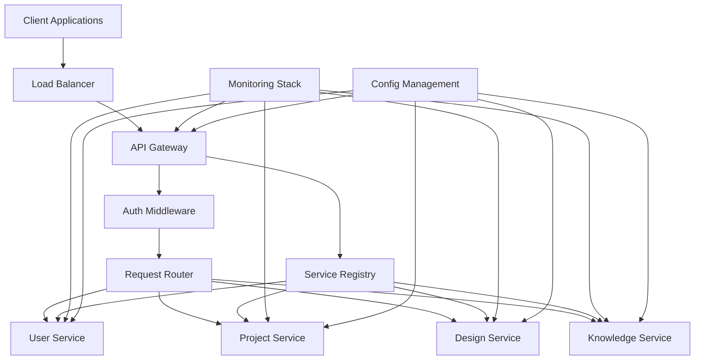
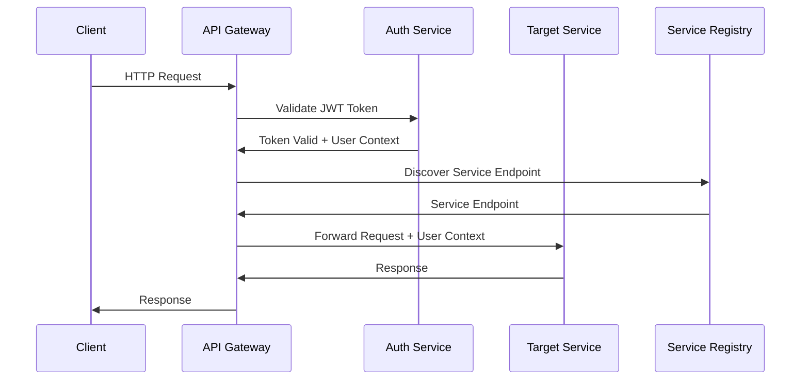

# Infrastructure Completion Design Document

## Overview

This design document outlines the technical architecture and implementation approach for completing the critical infrastructure components needed to make DesignSynapse production-ready. The solution focuses on implementing an API Gateway with service discovery, cross-service authentication, comprehensive monitoring, and production-grade configuration management.

The infrastructure will be built using industry-standard patterns and technologies, ensuring scalability, security, and observability. The design emphasizes minimal disruption to existing services while providing the foundation for production deployment.

## Architecture

### High-Level Architecture



### Service Communication Flow



## Components and Interfaces

### 1. API Gateway Service

**Location:** `apps/api-gateway/`

**Core Components:**
- **Request Router**: Routes requests based on URL patterns and service availability
- **Load Balancer**: Distributes requests across service instances
- **Rate Limiter**: Enforces request limits per client/endpoint
- **Circuit Breaker**: Prevents cascading failures
- **Middleware Pipeline**: Authentication, logging, metrics collection

**Key Interfaces:**
```python
class APIGateway:
    async def route_request(self, request: Request) -> Response
    async def health_check(self) -> HealthStatus
    async def get_service_routes(self) -> List[ServiceRoute]

class RateLimiter:
    async def is_allowed(self, client_id: str, endpoint: str) -> bool
    async def get_remaining_quota(self, client_id: str) -> int

class CircuitBreaker:
    async def call_service(self, service_name: str, request: Request) -> Response
    def get_circuit_status(self, service_name: str) -> CircuitStatus
```

### 2. Service Registry

**Location:** `packages/common/service-registry/`

**Core Components:**
- **Service Discovery**: Maintains registry of active services
- **Health Monitoring**: Tracks service health status
- **Load Balancing**: Provides service endpoint selection
- **Configuration Management**: Manages service routing rules

**Key Interfaces:**
```python
class ServiceRegistry:
    async def register_service(self, service: ServiceInfo) -> bool
    async def deregister_service(self, service_id: str) -> bool
    async def discover_services(self, service_name: str) -> List[ServiceEndpoint]
    async def get_healthy_endpoint(self, service_name: str) -> ServiceEndpoint

class HealthChecker:
    async def check_service_health(self, endpoint: ServiceEndpoint) -> HealthStatus
    async def get_aggregated_health(self) -> SystemHealthStatus
```

### 3. Authentication Middleware

**Location:** `packages/common/auth/`

**Core Components:**
- **JWT Validator**: Validates and decodes JWT tokens
- **Service-to-Service Auth**: Handles internal service authentication
- **Role-Based Access Control**: Enforces permissions
- **Token Refresh**: Manages token lifecycle

**Key Interfaces:**
```python
class AuthMiddleware:
    async def validate_token(self, token: str) -> UserContext
    async def check_permissions(self, user: UserContext, endpoint: str) -> bool
    async def generate_service_token(self, service_name: str) -> str

class JWTValidator:
    def decode_token(self, token: str) -> TokenPayload
    def validate_signature(self, token: str) -> bool
    def is_token_expired(self, token: str) -> bool
```

### 4. Monitoring Stack

**Location:** `packages/common/monitoring/`

**Core Components:**
- **Metrics Collector**: Collects performance and business metrics
- **Log Aggregator**: Centralizes structured logging
- **Distributed Tracing**: Tracks requests across services
- **Alerting Engine**: Triggers alerts based on thresholds

**Key Interfaces:**
```python
class MetricsCollector:
    def record_request_duration(self, service: str, endpoint: str, duration: float)
    def increment_counter(self, metric_name: str, labels: Dict[str, str])
    def set_gauge(self, metric_name: str, value: float, labels: Dict[str, str])

class LogAggregator:
    def log_request(self, request_id: str, service: str, level: str, message: str)
    def log_error(self, error: Exception, context: Dict[str, Any])
    def get_logs(self, filters: LogFilters) -> List[LogEntry]

class TracingCollector:
    def start_span(self, operation_name: str, parent_span: Optional[Span]) -> Span
    def finish_span(self, span: Span, status: SpanStatus)
    def get_trace(self, trace_id: str) -> Trace
```

### 5. Configuration Management

**Location:** `packages/common/config/`

**Core Components:**
- **Environment Config**: Manages environment-specific settings
- **Secrets Manager**: Handles sensitive configuration data
- **Config Validator**: Validates configuration on startup
- **Dynamic Config**: Supports runtime configuration updates

**Key Interfaces:**
```python
class ConfigManager:
    def load_config(self, service_name: str, environment: str) -> ServiceConfig
    def get_secret(self, secret_name: str) -> str
    def validate_config(self, config: ServiceConfig) -> ValidationResult
    def watch_config_changes(self, callback: Callable[[ConfigChange], None])

class SecretsManager:
    async def get_secret(self, key: str) -> str
    async def set_secret(self, key: str, value: str) -> bool
    def list_secrets(self) -> List[str]
```

## Data Models

### Service Registry Models

```python
@dataclass
class ServiceInfo:
    name: str
    version: str
    host: str
    port: int
    health_check_url: str
    metadata: Dict[str, Any]
    registered_at: datetime

@dataclass
class ServiceEndpoint:
    service_name: str
    url: str
    health_status: HealthStatus
    last_health_check: datetime
    response_time_ms: float

@dataclass
class HealthStatus:
    status: Literal["healthy", "unhealthy", "unknown"]
    message: str
    timestamp: datetime
    checks: List[HealthCheck]
```

### Authentication Models

```python
@dataclass
class UserContext:
    user_id: str
    email: str
    roles: List[str]
    permissions: List[str]
    service_name: Optional[str] = None  # For service-to-service auth

@dataclass
class TokenPayload:
    sub: str  # Subject (user_id)
    iat: int  # Issued at
    exp: int  # Expiration
    roles: List[str]
    service: Optional[str] = None

@dataclass
class ServiceToken:
    service_name: str
    token: str
    expires_at: datetime
```

### Monitoring Models

```python
@dataclass
class MetricPoint:
    name: str
    value: float
    labels: Dict[str, str]
    timestamp: datetime

@dataclass
class LogEntry:
    timestamp: datetime
    level: str
    service: str
    message: str
    request_id: Optional[str]
    user_id: Optional[str]
    metadata: Dict[str, Any]

@dataclass
class Span:
    trace_id: str
    span_id: str
    parent_span_id: Optional[str]
    operation_name: str
    start_time: datetime
    end_time: Optional[datetime]
    status: SpanStatus
    tags: Dict[str, str]
```

## Error Handling

### Standardized Error Responses

All services will use consistent error response formats:

```python
@dataclass
class ErrorResponse:
    error_code: str
    message: str
    details: Optional[Dict[str, Any]] = None
    request_id: str
    timestamp: datetime

# Common error codes
class ErrorCodes:
    AUTHENTICATION_FAILED = "AUTH_001"
    AUTHORIZATION_FAILED = "AUTH_002"
    SERVICE_UNAVAILABLE = "SVC_001"
    RATE_LIMIT_EXCEEDED = "RATE_001"
    VALIDATION_ERROR = "VAL_001"
    INTERNAL_ERROR = "INT_001"
```

### Circuit Breaker Implementation

```python
class CircuitBreakerState(Enum):
    CLOSED = "closed"      # Normal operation
    OPEN = "open"          # Failing, reject requests
    HALF_OPEN = "half_open"  # Testing if service recovered

@dataclass
class CircuitBreakerConfig:
    failure_threshold: int = 5
    recovery_timeout: int = 60
    success_threshold: int = 3
    timeout: int = 30
```

### Retry Strategy

```python
@dataclass
class RetryConfig:
    max_attempts: int = 3
    base_delay: float = 1.0
    max_delay: float = 60.0
    exponential_base: float = 2.0
    jitter: bool = True
    retryable_status_codes: List[int] = field(default_factory=lambda: [502, 503, 504])
```

## Testing Strategy

### Unit Testing
- **API Gateway**: Test routing logic, rate limiting, circuit breaker
- **Service Registry**: Test service registration, discovery, health checks
- **Auth Middleware**: Test token validation, permission checking
- **Monitoring**: Test metrics collection, log aggregation
- **Configuration**: Test config loading, validation, secrets management

### Integration Testing
- **End-to-End Request Flow**: Test complete request path through gateway
- **Service Discovery**: Test service registration and discovery workflows
- **Authentication Flow**: Test token validation across services
- **Health Check Aggregation**: Test system health monitoring
- **Error Handling**: Test error propagation and circuit breaker behavior

### Load Testing
- **Gateway Performance**: Test request throughput and latency
- **Rate Limiting**: Test rate limit enforcement under load
- **Service Discovery**: Test performance with multiple service instances
- **Monitoring Overhead**: Test monitoring impact on performance

### Security Testing
- **Authentication Bypass**: Test for authentication vulnerabilities
- **Authorization Escalation**: Test role-based access controls
- **Input Validation**: Test for injection attacks
- **Rate Limiting Bypass**: Test rate limiting effectiveness
- **Token Security**: Test JWT token handling and validation

## Implementation Phases

### Phase 1: Core Infrastructure (Week 1)
1. **API Gateway Service**: Basic routing and load balancing
2. **Service Registry**: Service registration and discovery
3. **Authentication Middleware**: JWT validation and user context
4. **Basic Monitoring**: Request logging and metrics collection

### Phase 2: Advanced Features (Week 2)
1. **Circuit Breaker**: Implement failure detection and recovery
2. **Rate Limiting**: Per-client and per-endpoint limits
3. **Health Check Aggregation**: System-wide health monitoring
4. **Configuration Management**: Environment-specific configs

### Phase 3: Production Hardening (Week 3)
1. **Security Headers**: CORS, CSP, HSTS implementation
2. **Distributed Tracing**: Request flow tracking
3. **Advanced Monitoring**: Dashboards and alerting
4. **Performance Optimization**: Caching and connection pooling

## Security Considerations

### Authentication Security
- JWT tokens signed with RS256 algorithm
- Token expiration and refresh mechanisms
- Service-to-service authentication with mutual TLS
- Rate limiting on authentication endpoints

### Network Security
- All external communications over HTTPS/TLS 1.3
- Internal service communication over mTLS
- Network segmentation and firewall rules
- API Gateway as single entry point

### Data Protection
- Sensitive data masking in logs
- Secrets stored in secure key management
- Input validation and sanitization
- SQL injection and XSS prevention

### Monitoring Security
- Audit logging for all authentication events
- Anomaly detection for suspicious patterns
- Automated blocking of malicious IPs
- Security incident alerting

## Performance Considerations

### Scalability
- Horizontal scaling of API Gateway instances
- Service registry with distributed consensus
- Connection pooling for database connections
- Async/await patterns for non-blocking I/O

### Caching Strategy
- Redis for session and rate limiting data
- CDN integration for static assets
- Application-level caching for frequent queries
- Cache invalidation strategies

### Resource Optimization
- Memory-efficient data structures
- CPU profiling and optimization
- Database query optimization
- Network bandwidth optimization

### Monitoring Performance
- Low-overhead metrics collection
- Sampling for distributed tracing
- Efficient log aggregation
- Real-time dashboard updates