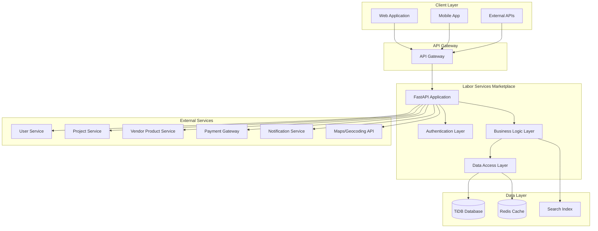
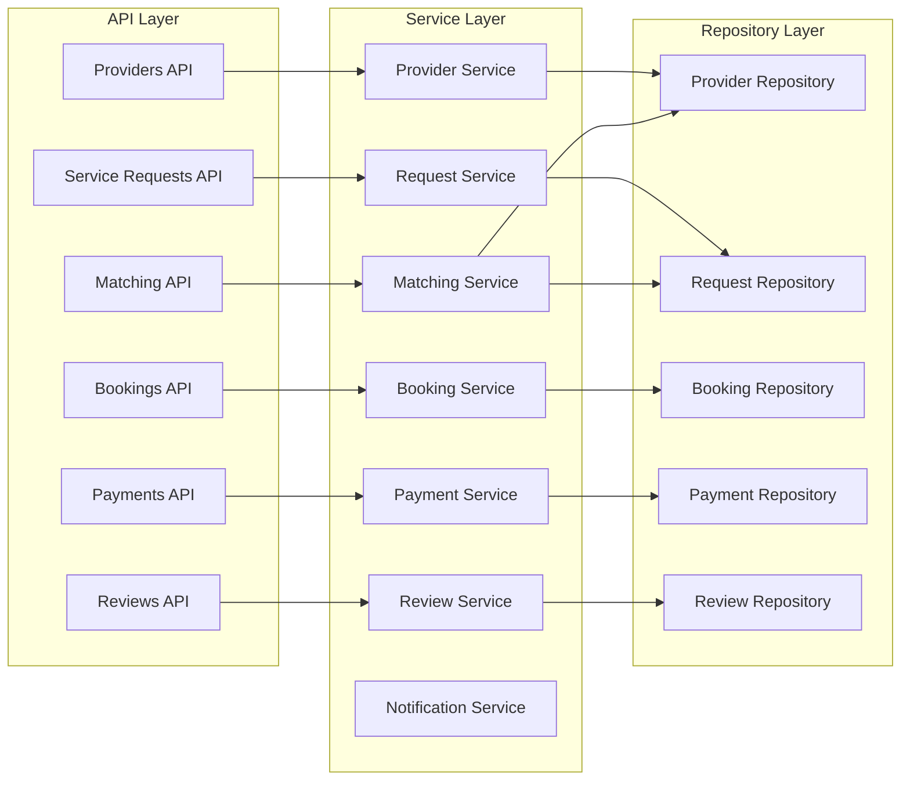

# Labor Services Marketplace Design

## Overview

The Labor Services Marketplace is a specialized platform that connects skilled construction and design professionals with clients needing labor services. Built on FastAPI with SQLAlchemy ORM, it provides comprehensive matching, booking, and payment capabilities while integrating with the broader DesignSynapse ecosystem.

## Architecture

### High-Level Architecture



### Service Architecture



## Components and Interfaces

### Core Models

#### Service Provider Model
```python
class ServiceProvider:
    id: int
    user_id: int  # Reference to User Service
    business_name: Optional[str]
    individual_name: str
    provider_type: ProviderType  # individual, business, team
    skills: List[Skill]
    certifications: List[Certification]
    service_areas: List[ServiceArea]
    availability: ProviderAvailability
    rates: RateStructure
    experience_years: int
    description: str
    portfolio_images: List[str]
    verification_status: VerificationStatus
    insurance_info: InsuranceInfo
    rating: float
    total_reviews: int
    total_jobs_completed: int
    response_time_avg: int  # minutes
    created_at: datetime
    updated_at: datetime
    is_active: bool

class Skill:
    id: int
    name: str
    category: SkillCategory
    proficiency_level: ProficiencyLevel
    years_experience: int
    certifications: List[str]

class ServiceArea:
    id: int
    provider_id: int
    center_latitude: float
    center_longitude: float
    radius_miles: int
    travel_rate: Optional[Decimal]
    is_primary: bool
```

#### Service Request Model
```python
class ServiceRequest:
    id: int
    seeker_id: int  # Reference to User Service
    project_id: Optional[int]  # Reference to Project Service
    title: str
    description: str
    skills_required: List[SkillRequirement]
    location: Location
    urgency_level: UrgencyLevel
    budget_range: BudgetRange
    preferred_start_date: datetime
    estimated_duration: int  # hours
    status: RequestStatus
    images: List[str]
    requirements: Dict[str, Any]  # insurance, licensing, etc.
    created_at: datetime
    updated_at: datetime

class SkillRequirement:
    skill_id: int
    required_level: ProficiencyLevel
    is_primary: bool
    estimated_hours: Optional[int]
```

#### Booking Model
```python
class Booking:
    id: int
    request_id: int
    provider_id: int
    seeker_id: int
    quote_id: int
    status: BookingStatus
    scheduled_start: datetime
    scheduled_end: datetime
    actual_start: Optional[datetime]
    actual_end: Optional[datetime]
    total_amount: Decimal
    payment_terms: PaymentTerms
    milestones: List[BookingMilestone]
    notes: Optional[str]
    cancellation_reason: Optional[str]
    created_at: datetime
    updated_at: datetime

class BookingMilestone:
    id: int
    booking_id: int
    description: str
    percentage: int
    amount: Decimal
    due_date: datetime
    status: MilestoneStatus
    completed_at: Optional[datetime]
```

#### Quote Model
```python
class Quote:
    id: int
    request_id: int
    provider_id: int
    labor_cost: Decimal
    material_cost: Optional[Decimal]
    travel_cost: Optional[Decimal]
    total_cost: Decimal
    estimated_hours: int
    start_availability: datetime
    completion_estimate: datetime
    terms: str
    status: QuoteStatus
    valid_until: datetime
    notes: Optional[str]
    created_at: datetime
    updated_at: datetime
```

### API Endpoints

#### Service Provider Management
- `POST /api/v1/providers` - Register as service provider
- `GET /api/v1/providers/{provider_id}` - Get provider profile
- `PUT /api/v1/providers/{provider_id}` - Update provider profile
- `POST /api/v1/providers/{provider_id}/skills` - Add/update skills
- `POST /api/v1/providers/{provider_id}/certifications` - Upload certifications
- `GET /api/v1/providers/{provider_id}/availability` - Get availability calendar
- `PUT /api/v1/providers/{provider_id}/availability` - Update availability
- `GET /api/v1/providers/{provider_id}/bookings` - Get provider bookings

#### Service Request Management
- `POST /api/v1/requests` - Create service request
- `GET /api/v1/requests/{request_id}` - Get request details
- `PUT /api/v1/requests/{request_id}` - Update request
- `DELETE /api/v1/requests/{request_id}` - Cancel request
- `GET /api/v1/requests/seeker/{seeker_id}` - Get seeker's requests
- `POST /api/v1/requests/{request_id}/quotes/request` - Request quotes from providers

#### Matching and Search
- `GET /api/v1/search/providers` - Search providers by criteria
- `POST /api/v1/matching/requests/{request_id}` - Get matched providers for request
- `GET /api/v1/matching/opportunities/{provider_id}` - Get opportunities for provider
- `POST /api/v1/matching/subscribe` - Subscribe to job alerts

#### Quote Management
- `POST /api/v1/quotes` - Submit quote for request
- `GET /api/v1/quotes/{quote_id}` - Get quote details
- `PUT /api/v1/quotes/{quote_id}` - Update quote
- `POST /api/v1/quotes/{quote_id}/accept` - Accept quote
- `POST /api/v1/quotes/{quote_id}/counter` - Submit counter-proposal
- `GET /api/v1/requests/{request_id}/quotes` - Get all quotes for request

#### Booking Management
- `POST /api/v1/bookings` - Create booking from accepted quote
- `GET /api/v1/bookings/{booking_id}` - Get booking details
- `PUT /api/v1/bookings/{booking_id}/status` - Update booking status
- `POST /api/v1/bookings/{booking_id}/milestones/{milestone_id}/complete` - Mark milestone complete
- `POST /api/v1/bookings/{booking_id}/reschedule` - Request reschedule
- `POST /api/v1/bookings/{booking_id}/cancel` - Cancel booking

#### Payment Management
- `POST /api/v1/payments/process` - Process milestone payment
- `GET /api/v1/payments/booking/{booking_id}` - Get payment history
- `POST /api/v1/payments/escrow/release` - Release escrow payment
- `POST /api/v1/payments/dispute` - Initiate payment dispute

#### Reviews and Ratings
- `POST /api/v1/reviews` - Submit review after job completion
- `GET /api/v1/reviews/provider/{provider_id}` - Get provider reviews
- `GET /api/v1/reviews/seeker/{seeker_id}` - Get seeker reviews
- `PUT /api/v1/reviews/{review_id}` - Update review
- `POST /api/v1/reviews/{review_id}/helpful` - Mark review helpful

### Service Interfaces

#### IProviderService
```python
class IProviderService:
    async def register_provider(self, provider_data: ProviderCreate) -> ServiceProvider
    async def get_provider(self, provider_id: int) -> Optional[ServiceProvider]
    async def update_provider(self, provider_id: int, updates: ProviderUpdate) -> ServiceProvider
    async def add_skill(self, provider_id: int, skill: SkillCreate) -> Skill
    async def update_availability(self, provider_id: int, availability: AvailabilityUpdate) -> bool
    async def get_provider_analytics(self, provider_id: int) -> ProviderAnalytics
```

#### IMatchingService
```python
class IMatchingService:
    async def find_providers_for_request(self, request_id: int) -> List[ProviderMatch]
    async def find_opportunities_for_provider(self, provider_id: int) -> List[RequestMatch]
    async def calculate_match_score(self, provider_id: int, request_id: int) -> float
    async def send_job_alerts(self, provider_id: int, criteria: AlertCriteria) -> bool
```

#### IBookingService
```python
class IBookingService:
    async def create_booking(self, quote_id: int) -> Booking
    async def update_booking_status(self, booking_id: int, status: BookingStatus) -> Booking
    async def complete_milestone(self, milestone_id: int) -> BookingMilestone
    async def reschedule_booking(self, booking_id: int, new_schedule: ScheduleUpdate) -> Booking
    async def cancel_booking(self, booking_id: int, reason: str) -> bool
```

## Data Models

### Database Schema

```sql
-- Service providers table
CREATE TABLE service_providers (
    id BIGINT PRIMARY KEY AUTO_INCREMENT,
    user_id BIGINT NOT NULL,
    business_name VARCHAR(255),
    individual_name VARCHAR(255) NOT NULL,
    provider_type ENUM('individual', 'business', 'team') NOT NULL,
    description TEXT,
    experience_years INT DEFAULT 0,
    verification_status ENUM('pending', 'verified', 'rejected') DEFAULT 'pending',
    rating DECIMAL(3,2) DEFAULT 0.00,
    total_reviews INT DEFAULT 0,
    total_jobs_completed INT DEFAULT 0,
    response_time_avg INT DEFAULT 0,
    created_at TIMESTAMP DEFAULT CURRENT_TIMESTAMP,
    updated_at TIMESTAMP DEFAULT CURRENT_TIMESTAMP ON UPDATE CURRENT_TIMESTAMP,
    is_active BOOLEAN DEFAULT true,
    INDEX idx_user_id (user_id),
    INDEX idx_verification_status (verification_status),
    INDEX idx_rating (rating),
    INDEX idx_location (verification_status, is_active)
);

-- Skills and categories
CREATE TABLE skill_categories (
    id BIGINT PRIMARY KEY AUTO_INCREMENT,
    name VARCHAR(100) NOT NULL,
    description TEXT,
    sort_order INT DEFAULT 0,
    is_active BOOLEAN DEFAULT true
);

CREATE TABLE skills (
    id BIGINT PRIMARY KEY AUTO_INCREMENT,
    category_id BIGINT NOT NULL,
    name VARCHAR(100) NOT NULL,
    description TEXT,
    requires_certification BOOLEAN DEFAULT false,
    FOREIGN KEY (category_id) REFERENCES skill_categories(id),
    INDEX idx_category_id (category_id)
);

-- Provider skills junction table
CREATE TABLE provider_skills (
    id BIGINT PRIMARY KEY AUTO_INCREMENT,
    provider_id BIGINT NOT NULL,
    skill_id BIGINT NOT NULL,
    proficiency_level ENUM('beginner', 'intermediate', 'advanced', 'expert') NOT NULL,
    years_experience INT DEFAULT 0,
    certifications JSON,
    hourly_rate DECIMAL(8,2),
    FOREIGN KEY (provider_id) REFERENCES service_providers(id) ON DELETE CASCADE,
    FOREIGN KEY (skill_id) REFERENCES skills(id),
    UNIQUE KEY unique_provider_skill (provider_id, skill_id),
    INDEX idx_provider_id (provider_id),
    INDEX idx_skill_id (skill_id)
);

-- Service areas
CREATE TABLE service_areas (
    id BIGINT PRIMARY KEY AUTO_INCREMENT,
    provider_id BIGINT NOT NULL,
    center_latitude DECIMAL(10,8) NOT NULL,
    center_longitude DECIMAL(11,8) NOT NULL,
    radius_miles INT NOT NULL,
    travel_rate DECIMAL(8,2),
    is_primary BOOLEAN DEFAULT false,
    FOREIGN KEY (provider_id) REFERENCES service_providers(id) ON DELETE CASCADE,
    INDEX idx_provider_id (provider_id),
    INDEX idx_location (center_latitude, center_longitude)
);

-- Service requests
CREATE TABLE service_requests (
    id BIGINT PRIMARY KEY AUTO_INCREMENT,
    seeker_id BIGINT NOT NULL,
    project_id BIGINT,
    title VARCHAR(255) NOT NULL,
    description TEXT NOT NULL,
    location_latitude DECIMAL(10,8) NOT NULL,
    location_longitude DECIMAL(11,8) NOT NULL,
    location_address TEXT NOT NULL,
    urgency_level ENUM('low', 'medium', 'high', 'emergency') DEFAULT 'medium',
    budget_min DECIMAL(10,2),
    budget_max DECIMAL(10,2),
    preferred_start_date TIMESTAMP,
    estimated_duration_hours INT,
    status ENUM('draft', 'active', 'quoted', 'booked', 'completed', 'cancelled') DEFAULT 'draft',
    requirements JSON,
    images JSON,
    created_at TIMESTAMP DEFAULT CURRENT_TIMESTAMP,
    updated_at TIMESTAMP DEFAULT CURRENT_TIMESTAMP ON UPDATE CURRENT_TIMESTAMP,
    INDEX idx_seeker_id (seeker_id),
    INDEX idx_project_id (project_id),
    INDEX idx_status (status),
    INDEX idx_location (location_latitude, location_longitude),
    INDEX idx_urgency (urgency_level, status)
);

-- Request skill requirements
CREATE TABLE request_skill_requirements (
    id BIGINT PRIMARY KEY AUTO_INCREMENT,
    request_id BIGINT NOT NULL,
    skill_id BIGINT NOT NULL,
    required_level ENUM('beginner', 'intermediate', 'advanced', 'expert') NOT NULL,
    is_primary BOOLEAN DEFAULT false,
    estimated_hours INT,
    FOREIGN KEY (request_id) REFERENCES service_requests(id) ON DELETE CASCADE,
    FOREIGN KEY (skill_id) REFERENCES skills(id),
    INDEX idx_request_id (request_id),
    INDEX idx_skill_id (skill_id)
);

-- Quotes
CREATE TABLE quotes (
    id BIGINT PRIMARY KEY AUTO_INCREMENT,
    request_id BIGINT NOT NULL,
    provider_id BIGINT NOT NULL,
    labor_cost DECIMAL(10,2) NOT NULL,
    material_cost DECIMAL(10,2) DEFAULT 0.00,
    travel_cost DECIMAL(10,2) DEFAULT 0.00,
    total_cost DECIMAL(10,2) NOT NULL,
    estimated_hours INT NOT NULL,
    start_availability TIMESTAMP NOT NULL,
    completion_estimate TIMESTAMP NOT NULL,
    terms TEXT,
    status ENUM('draft', 'submitted', 'accepted', 'rejected', 'expired') DEFAULT 'draft',
    valid_until TIMESTAMP NOT NULL,
    notes TEXT,
    created_at TIMESTAMP DEFAULT CURRENT_TIMESTAMP,
    updated_at TIMESTAMP DEFAULT CURRENT_TIMESTAMP ON UPDATE CURRENT_TIMESTAMP,
    FOREIGN KEY (request_id) REFERENCES service_requests(id),
    FOREIGN KEY (provider_id) REFERENCES service_providers(id),
    INDEX idx_request_id (request_id),
    INDEX idx_provider_id (provider_id),
    INDEX idx_status (status)
);

-- Bookings
CREATE TABLE bookings (
    id BIGINT PRIMARY KEY AUTO_INCREMENT,
    request_id BIGINT NOT NULL,
    provider_id BIGINT NOT NULL,
    seeker_id BIGINT NOT NULL,
    quote_id BIGINT NOT NULL,
    status ENUM('confirmed', 'in_progress', 'completed', 'cancelled', 'disputed') DEFAULT 'confirmed',
    scheduled_start TIMESTAMP NOT NULL,
    scheduled_end TIMESTAMP NOT NULL,
    actual_start TIMESTAMP,
    actual_end TIMESTAMP,
    total_amount DECIMAL(10,2) NOT NULL,
    payment_terms JSON,
    notes TEXT,
    cancellation_reason TEXT,
    created_at TIMESTAMP DEFAULT CURRENT_TIMESTAMP,
    updated_at TIMESTAMP DEFAULT CURRENT_TIMESTAMP ON UPDATE CURRENT_TIMESTAMP,
    FOREIGN KEY (request_id) REFERENCES service_requests(id),
    FOREIGN KEY (provider_id) REFERENCES service_providers(id),
    FOREIGN KEY (quote_id) REFERENCES quotes(id),
    INDEX idx_request_id (request_id),
    INDEX idx_provider_id (provider_id),
    INDEX idx_seeker_id (seeker_id),
    INDEX idx_status (status),
    INDEX idx_scheduled_start (scheduled_start)
);

-- Reviews
CREATE TABLE reviews (
    id BIGINT PRIMARY KEY AUTO_INCREMENT,
    booking_id BIGINT NOT NULL,
    reviewer_id BIGINT NOT NULL,
    reviewee_id BIGINT NOT NULL,
    reviewer_type ENUM('provider', 'seeker') NOT NULL,
    rating INT NOT NULL CHECK (rating >= 1 AND rating <= 5),
    title VARCHAR(255),
    content TEXT,
    categories JSON, -- quality, timeliness, communication, etc.
    is_verified BOOLEAN DEFAULT true,
    helpful_votes INT DEFAULT 0,
    created_at TIMESTAMP DEFAULT CURRENT_TIMESTAMP,
    updated_at TIMESTAMP DEFAULT CURRENT_TIMESTAMP ON UPDATE CURRENT_TIMESTAMP,
    FOREIGN KEY (booking_id) REFERENCES bookings(id),
    INDEX idx_booking_id (booking_id),
    INDEX idx_reviewee_id (reviewee_id),
    INDEX idx_rating (rating)
);
```

## Matching Algorithm

### Provider-Request Matching Logic
```python
class MatchingAlgorithm:
    def calculate_match_score(self, provider: ServiceProvider, request: ServiceRequest) -> float:
        """Calculate compatibility score between provider and request"""

        # Skill match (40% weight)
        skill_score = self._calculate_skill_match(provider.skills, request.skills_required)

        # Location proximity (25% weight)
        distance_score = self._calculate_distance_score(provider.service_areas, request.location)

        # Availability match (20% weight)
        availability_score = self._calculate_availability_match(provider.availability, request.preferred_start_date)

        # Rating and reputation (10% weight)
        reputation_score = self._calculate_reputation_score(provider.rating, provider.total_reviews)

        # Response time (5% weight)
        response_score = self._calculate_response_score(provider.response_time_avg)

        total_score = (
            skill_score * 0.40 +
            distance_score * 0.25 +
            availability_score * 0.20 +
            reputation_score * 0.10 +
            response_score * 0.05
        )

        return min(total_score, 1.0)
```

## Integration Points

### Project Service Integration
- Link service requests to specific project phases
- Coordinate labor scheduling with project timelines
- Track labor costs against project budgets
- Enable bulk hiring for multi-trade projects

### Vendor Product Service Integration
- Cross-reference material needs with labor services
- Enable coordinated delivery of materials and labor
- Support integrated project procurement workflows

### Payment Integration
- Escrow services for larger projects
- Milestone-based payments
- Automated tax reporting and 1099 generation
- Dispute resolution workflows

## Security and Compliance

### Background Checks and Verification
- Integration with third-party background check services
- License verification through state databases
- Insurance validation and tracking
- Certification authenticity verification

### Data Protection
- PII encryption for sensitive provider information
- Secure document storage for certifications and licenses
- GDPR compliance for international providers
- Audit trails for all sensitive operations

## Performance Considerations

### Geospatial Optimization
- Spatial indexing for location-based searches
- Efficient radius queries for service area matching
- Caching of frequently accessed location data

### Real-time Matching
- Event-driven architecture for immediate job notifications
- WebSocket connections for live booking updates
- Optimized matching algorithms for large provider pools

## Mobile Optimization

### Provider Mobile Features
- GPS-based location services
- Photo uploads for work documentation
- Push notifications for job opportunities
- Offline capability for basic profile management

### Seeker Mobile Features
- Location-based provider search
- Real-time booking status updates
- Mobile payment processing
- Emergency service request capabilities
