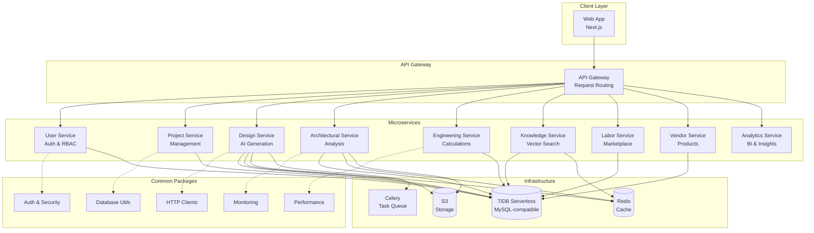

# Design Document: Professional README Enhancement

## Overview

This design document specifies the structure, content, and implementation approach for transforming the DesignSynapse platform README into a professional, compelling document that effectively showcases the platform's technical sophistication, production readiness, and value proposition.

The enhancement will create a comprehensive README that serves multiple audiences (recruiters, contributors, stakeholders) while maintaining clarity, visual appeal, and professional polish. The design focuses on content organization, visual elements, and information architecture rather than code implementation.

## Architecture

### Document Structure

The enhanced README will follow a hierarchical information architecture optimized for different reader personas:

```
README.md
├── Hero Section (Visual Identity + Value Proposition)
├── Table of Contents (Navigation)
├── Overview & Problem Statement
├── Key Features & Benefits
├── Architecture & Technical Stack
├── Services Matrix (Status + Coverage)
├── Quick Start Guide
├── Project Structure
├── Testing Excellence
├── Common Packages
├── Production Readiness
├── Performance & Scalability
├── Documentation Links
├── Development Workflow
├── Roadmap & Vision
├── Contributing Guidelines
├── License & Acknowledgments
└── Metrics & Achievements
```

### Content Organization Principles

1. **Progressive Disclosure**: Most important information first, details accessible via links
2. **Scannable Format**: Use of headings, bullets, tables, and visual elements
3. **Multi-Persona Design**: Content structured for recruiters, contributors, and stakeholders
4. **Visual Hierarchy**: Consistent use of H1/H2/H3 headings with clear relationships
5. **Action-Oriented**: Clear next steps and calls-to-action throughout

### Visual Design System

**Typography Hierarchy:**
- H1: Project title only
- H2: Major sections (Overview, Architecture, Testing, etc.)
- H3: Subsections within major sections
- H4: Specific topics within subsections (rarely used)

**Visual Elements:**
- Badges: Status indicators at the top
- Emojis: Section markers for improved scannability
- Code blocks: Syntax-highlighted examples
- Tables: Structured data (services, tech stack, status)
- Diagrams: Architecture visualization (Mermaid)

## Components and Interfaces

### 1. Hero Section Component

**Purpose**: Immediate visual impact and value proposition

**Content Elements:**
- Project name with tagline
- Brief description (1-2 sentences)
- Status badges (build, coverage, license, Python version)
- Key differentiators (AI-driven, 9+ microservices, 80%+ coverage)

**Design Pattern:**
```markdown
# DesignSynapse 🏗️

[](link)
[](link)
[](link)
[](link)

> AI-Powered DAEC Platform | 9+ Microservices | 80%+ Test Coverage | Production-Ready

**Transform the global construction industry** with intelligent tools that bridge design and execution, making sustainable and efficient construction practices the norm.
```

### 2. Table of Contents Component

**Purpose**: Quick navigation for long document

**Content Elements:**
- Anchor links to all major sections
- Organized by logical flow
- Collapsible on GitHub for space efficiency

**Design Pattern:**
```markdown
## Table of Contents

- [Overview](#overview)
- [Key Features](#key-features)
- [Architecture](#architecture)
- [Services](#services)
- [Quick Start](#quick-start)
- [Testing](#testing)
- [Documentation](#documentation)
- [Contributing](#contributing)
```

### 3. Architecture Diagram Component

**Purpose**: Visual representation of system architecture

**Content Elements:**
- Microservices and their relationships
- External dependencies (TiDB, Redis, S3)
- Communication patterns (HTTP, WebSocket, async)
- Common packages layer

**Design Pattern:**
```markdown
## Architecture


```

### 4. Services Matrix Component

**Purpose**: Showcase service maturity and test coverage

**Content Elements:**
- Service name and description
- Production status (✅ Complete, 🔨 In Progress, 📋 Planned)
- Test coverage percentage
- Key features (3-5 bullets)
- Link to service README

**Design Pattern:**
```markdown
## Services

| Service | Status | Coverage | Key Features |
|---------|--------|----------|--------------|
| **Architectural Service** | ✅ Production | 92%+ | Design management, compliance checking, structural analysis, real-time collaboration |
| **Design Service** | ✅ Production | 85%+ | AI-powered generation, visual outputs, validation, Celery tasks |
| **Knowledge Service** | ✅ Production | 88%+ | Vector search, PDF processing, recommendations, caching |
| **Labor Service** | ✅ Production | 86%+ | Marketplace, matching algorithm, bookings, reviews |
| **Vendor Service** | ✅ Production | 84%+ | Product catalog, order management, staging, reviews |
| **Project Service** | ✅ Production | 82%+ | Lifecycle management, collaboration, activity logging |
| **User Service** | ✅ Production | 89%+ | JWT auth, RBAC, user profiles, organizations |
| **Engineering Service** | 🔨 In Progress | 78%+ | MEP calculations, structural design, civil engineering |
| **Analytics Service** | 📋 Planned | - | BI dashboards, drone analytics, performance monitoring |

[View detailed service documentation →](apps/)
```

### 5. Technology Stack Component

**Purpose**: Showcase technical sophistication

**Content Elements:**
- Technologies organized by category
- Version requirements where relevant
- Links to official documentation
- Highlight advanced features

**Design Pattern:**
```markdown
## Technology Stack

### Backend
- **Framework**: FastAPI (Python 3.13+) - High-performance async API framework
- **Database**: TiDB Serverless - MySQL-compatible distributed SQL with auto-scaling
- **Caching**: Redis 7+ - In-memory data store for performance optimization
- **Task Queue**: Celery - Distributed task processing for async operations
- **ORM**: SQLAlchemy (async) - Modern async database toolkit
- **Validation**: Pydantic v2 - Data validation using Python type annotations

### Frontend
- **Framework**: Next.js - React framework with SSR and SSG
- **Language**: TypeScript - Type-safe JavaScript
- **Styling**: TailwindCSS - Utility-first CSS framework

### Infrastructure
- **Containerization**: Docker & Docker Compose
- **Database**: TiDB Cloud (Serverless) with auto-scaling
- **Storage**: S3-compatible object storage
- **Monitoring**: Prometheus & Grafana (planned)
- **CI/CD**: GitHub Actions

### Testing & Quality
- **Testing**: pytest with async support
- **Property-Based Testing**: Hypothesis - Automated test case generation
- **Code Quality**: Black, Flake8, isort, mypy
- **Coverage Target**: 80%+ minimum, 90%+ for critical services
```

### 6. Testing Excellence Component

**Purpose**: Highlight quality assurance practices

**Content Elements:**
- Multi-layered testing approach
- Property-based testing explanation
- Coverage metrics and targets
- Example test commands

**Design Pattern:**
```markdown
## Testing Excellence

DesignSynapse employs a comprehensive, multi-layered testing strategy to ensure code quality and correctness:

### Testing Layers

1. **Unit Tests** - Test individual components in isolation
   - Fast execution (< 1 second per test)
   - Mocked dependencies
   - Focus on business logic

2. **Integration Tests** - Test API endpoints and service interactions
   - Real database connections
   - Service-to-service communication
   - End-to-end workflows

3. **Property-Based Tests** - Test universal properties with randomized inputs
   - Powered by Hypothesis
   - 100+ iterations per property
   - Discovers edge cases automatically

### Coverage Metrics

- **Platform Average**: 85%+ test coverage
- **Production Services**: 80%+ minimum coverage
- **Exemplary Services**: 90%+ coverage
  - Architectural Service: 92%+
  - User Service: 89%+
  - Knowledge Service: 88%+

### Running Tests

```bash
# Run all tests
pytest

# Run with coverage report
pytest --cov=src --cov-report=html --cov-report=term

# Run property-based tests
pytest -m property

# Run specific service tests
cd apps/architectural-service && pytest
```

### Property-Based Testing Example

```python
from hypothesis import given, strategies as st

@given(
    name=st.text(min_size=1, max_size=100),
    building_type=st.sampled_from(["residential", "commercial", "industrial"])
)
async def test_property_design_creation(name, building_type):
    """Property: All valid designs should be created successfully."""
    design = await service.create_design(name=name, building_type=building_type)
    assert design.id is not None
    assert design.version == "1.0"
    assert design.status == "draft"
```
```

### 7. Common Packages Component

**Purpose**: Showcase code reusability and DRY principles

**Content Elements:**
- Packages organized by category
- Brief description of each package
- Production-ready patterns highlighted
- Links to package documentation

**Design Pattern:**
```markdown
## Common Packages

DesignSynapse includes 10+ shared packages that provide production-ready functionality across all microservices:

### Authentication & Security
- **`auth/`** - JWT validation, RBAC, service-to-service authentication
- **`security/`** - Input validation, threat detection, audit logging, security middleware

### Infrastructure
- **`database/`** - Connection management, health checks, migration utilities
- **`http/`** - Service clients with retry logic, circuit breakers, and timeouts
- **`service_registry/`** - Service discovery, health monitoring, load balancing
- **`storage/`** - S3-compatible object storage abstraction

### Observability
- **`monitoring/`** - Structured logging, Prometheus metrics, distributed tracing
- **`performance/`** - Multi-layer caching, CDN integration, connection pooling

### Resilience
- **`resilience/`** - Circuit breakers, exponential backoff, retry policies
- **`rate_limiting/`** - Token bucket and sliding window algorithms
- **`errors/`** - Standardized error handling, error responses, exception hierarchy

### Development
- **`testing/`** - Test fixtures, factories, database utilities, mocks
- **`config/`** - Configuration management, secrets handling, environment validation

[View package documentation →](packages/common/)
```

### 8. Quick Start Component

**Purpose**: Enable rapid onboarding for contributors

**Content Elements:**
- Prerequisites with versions
- Step-by-step setup instructions
- Common commands
- Verification steps

**Design Pattern:**
```markdown
## Quick Start

### Prerequisites

- **Python**: 3.13 or higher
- **Docker**: 20.10+ with Docker Compose
- **Node.js**: 18+ (for frontend)
- **Git**: 2.30+

### Setup

1. **Clone the repository**
   ```bash
   git clone https://github.com/designsynapse/platform.git
   cd platform
   ```

2. **Set up environment**
   ```bash
   cp .env.example .env
   # Edit .env with your configuration
   ```

3. **Start infrastructure services**
   ```bash
   docker-compose up -d tidb redis
   ```

4. **Set up a service (example: Architectural Service)**
   ```bash
   cd apps/architectural-service
   python -m venv venv
   source venv/bin/activate  # On Windows: venv\Scripts\activate
   pip install -r requirements.txt
   alembic upgrade head
   ```

5. **Run the service**
   ```bash
   uvicorn src.main:app --reload --port 8005
   ```

6. **Verify**
   ```bash
   curl http://localhost:8005/api/v1/health
   ```

### Common Commands

```bash
# Run tests
pytest

# Format code
black src/ tests/

# Lint code
flake8 src/ tests/

# Type check
mypy src/

# Generate coverage report
pytest --cov=src --cov-report=html
```

[View detailed setup guide →](docs/ENV.md)
```

### 9. Production Readiness Component

**Purpose**: Demonstrate enterprise-grade practices

**Content Elements:**
- Docker and containerization
- CI/CD workflows
- Monitoring and observability
- Security practices
- Deployment considerations

**Design Pattern:**
```markdown
## Production Readiness

DesignSynapse is built with production-grade practices and enterprise readiness:

### Containerization
- **Docker**: All services containerized with multi-stage builds
- **Docker Compose**: Local development environment orchestration
- **Health Checks**: Built-in health endpoints for all services
- **Resource Limits**: Configured memory and CPU limits

### CI/CD
- **GitHub Actions**: Automated testing, linting, and deployment
- **Test Automation**: All tests run on every pull request
- **Code Quality Gates**: Coverage and linting checks enforced
- **Deployment Pipelines**: Automated deployment to staging and production

### Monitoring & Observability
- **Structured Logging**: JSON-formatted logs with correlation IDs
- **Metrics**: Prometheus-compatible metrics endpoints
- **Distributed Tracing**: OpenTelemetry integration (planned)
- **Health Checks**: Liveness and readiness probes for all services
- **Dashboards**: Grafana dashboards for system monitoring (planned)

### Security
- **Authentication**: JWT-based authentication with refresh tokens
- **Authorization**: Role-based access control (RBAC) with fine-grained permissions
- **Input Validation**: Pydantic schemas with strict validation
- **Threat Detection**: Automated threat detection and audit logging
- **Secrets Management**: Environment-based secrets with validation
- **Rate Limiting**: Token bucket and sliding window algorithms

### Resilience
- **Circuit Breakers**: Automatic failure detection and recovery
- **Retry Logic**: Exponential backoff with jitter
- **Timeouts**: Configured timeouts for all external calls
- **Connection Pooling**: Optimized database connection management
- **Caching**: Multi-layer caching strategy (Redis, in-memory)

### Performance
- **Async Architecture**: FastAPI with async/await throughout
- **Connection Pooling**: Database connection pooling with SQLAlchemy
- **Caching Strategy**: Redis for distributed caching, in-memory for hot data
- **CDN Integration**: Static asset delivery optimization
- **Database Optimization**: TiDB auto-scaling for dynamic workloads

[View deployment documentation →](docs/)
```

### 10. Roadmap Component

**Purpose**: Show vision and future direction

**Content Elements:**
- Current status
- Near-term goals
- Long-term vision
- Link to detailed roadmap

**Design Pattern:**
```markdown
## Roadmap & Vision

### Current Status (2024)

🚧 **Active Development** - Production-Ready Services:
- ✅ Architectural Service - Complete with 92%+ test coverage
- ✅ Design Service - Complete with AI-powered visual generation
- ✅ Knowledge Service - Complete with vector search and recommendations
- ✅ Labor Service - Complete with marketplace functionality
- ✅ Vendor Service - Complete with order management
- ✅ Project Service - Complete with collaboration features
- ✅ User Service - Complete with RBAC
- 🔨 Engineering Service - In active development
- 📋 Analytics Service - In specification phase

### Near-Term Goals (2025)

- **Simulation Service**: Real-time 3D rendering and interactive walkthroughs
- **Performance Optimization**: 10x faster generation with cloud GPU integration
- **VR/AR Integration**: Immersive property visualization
- **Global Expansion**: Multi-language support and international standards

### Long-Term Vision (2026+)

- **Video Generation Service**: Automated property tour videos and marketing content
- **Avatar Sales Agents**: AI-powered digital twins for 24/7 property sales
- **Real Estate Platform**: End-to-end property sales and management
- **Market Transformation**: Revolutionize the $280 trillion global real estate industry

[View detailed roadmap →](docs/FUTURE_VISION_ROADMAP.md)
```

## Data Models

### README Content Schema

```typescript
interface READMEContent {
  hero: {
    title: string;
    tagline: string;
    badges: Badge[];
    description: string;
  };

  tableOfContents: {
    sections: Section[];
  };

  overview: {
    problemStatement: string;
    solution: string;
    keyBenefits: string[];
  };

  architecture: {
    diagram: string; // Mermaid diagram
    description: string;
    patterns: string[];
  };

  services: {
    matrix: ServiceInfo[];
  };

  techStack: {
    backend: Technology[];
    frontend: Technology[];
    infrastructure: Technology[];
    testing: Technology[];
  };

  testing: {
    approach: string;
    layers: TestLayer[];
    coverage: CoverageMetrics;
    examples: CodeExample[];
  };

  commonPackages: {
    categories: PackageCategory[];
  };

  quickStart: {
    prerequisites: Prerequisite[];
    steps: SetupStep[];
    commands: Command[];
  };

  productionReadiness: {
    containerization: Feature[];
    cicd: Feature[];
    monitoring: Feature[];
    security: Feature[];
    resilience: Feature[];
    performance: Feature[];
  };

  roadmap: {
    currentStatus: StatusItem[];
    nearTerm: Goal[];
    longTerm: Vision[];
  };

  documentation: {
    links: DocumentLink[];
  };

  contributing: {
    guidelines: string;
    workflow: string;
    codeQuality: Tool[];
  };

  license: {
    type: string;
    acknowledgments: string[];
  };
}

interface Badge {
  name: string;
  imageUrl: string;
  linkUrl: string;
}

interface ServiceInfo {
  name: string;
  status: "production" | "in-progress" | "planned";
  coverage: number;
  keyFeatures: string[];
  readmeLink: string;
}

interface Technology {
  name: string;
  version?: string;
  description: string;
  link?: string;
}

interface TestLayer {
  name: string;
  description: string;
  characteristics: string[];
}

interface CoverageMetrics {
  platformAverage: number;
  minimumTarget: number;
  exemplaryServices: {
    name: string;
    coverage: number;
  }[];
}

interface PackageCategory {
  name: string;
  packages: {
    name: string;
    description: string;
    link: string;
  }[];
}
```

### Badge Configuration

```typescript
interface BadgeConfig {
  buildStatus: {
    service: "github-actions";
    workflow: "CI";
    branch: "main";
  };

  testCoverage: {
    service: "codecov" | "coveralls";
    threshold: 80;
  };

  license: {
    type: "MIT";
    color: "blue";
  };

  pythonVersion: {
    version: "3.13+";
    color: "blue";
  };
}
```

## Error Handling

### Content Validation

**Missing Required Sections:**
- Validation: Ensure all required sections are present
- Handling: Checklist for content creators
- Recovery: Template with placeholders for missing sections

**Broken Links:**
- Validation: Check all internal and external links
- Handling: Link checker script in CI/CD
- Recovery: Update or remove broken links

**Outdated Information:**
- Validation: Version numbers, coverage metrics, service status
- Handling: Automated updates from CI/CD metrics
- Recovery: Manual review and update process

**Inconsistent Formatting:**
- Validation: Markdown linting (markdownlint)
- Handling: Pre-commit hooks for formatting
- Recovery: Automated formatting with prettier

### Quality Assurance

```bash
# Markdown linting
markdownlint README.md

# Link checking
markdown-link-check README.md

# Spell checking
cspell README.md

# Length validation (ensure not too long)
wc -l README.md  # Target: < 1000 lines
```

## Testing Strategy

### Content Testing

Since this is a documentation enhancement rather than a code feature, traditional unit/integration/property-based testing does not apply. Instead, the testing strategy focuses on content quality assurance:

#### 1. Manual Review Testing
- **Peer Review**: Have team members review for clarity and completeness
- **Persona Testing**: Review from recruiter, contributor, and stakeholder perspectives
- **Readability Testing**: Ensure content is scannable and easy to understand

#### 2. Automated Content Validation
- **Markdown Linting**: Validate markdown syntax and formatting
- **Link Checking**: Verify all links are valid and accessible
- **Spell Checking**: Catch typos and spelling errors
- **Length Validation**: Ensure document is not too long (< 1000 lines)

#### 3. Visual Testing
- **GitHub Preview**: Verify rendering on GitHub
- **Mobile View**: Check readability on mobile devices
- **Dark Mode**: Verify appearance in dark mode

#### 4. Metrics Validation
- **Coverage Numbers**: Verify test coverage percentages are accurate
- **Service Status**: Confirm production status is current
- **Version Numbers**: Ensure technology versions are up-to-date

#### 5. User Testing
- **Recruiter Feedback**: Get feedback from technical recruiters
- **Contributor Feedback**: Test with new contributors
- **Stakeholder Review**: Review with project stakeholders

### Validation Checklist

```markdown
## README Quality Checklist

### Content Completeness
- [ ] Hero section with badges
- [ ] Table of contents
- [ ] Overview and problem statement
- [ ] Architecture diagram
- [ ] Services matrix with coverage
- [ ] Technology stack
- [ ] Testing excellence section
- [ ] Common packages
- [ ] Quick start guide
- [ ] Production readiness
- [ ] Roadmap and vision
- [ ] Documentation links
- [ ] Contributing guidelines
- [ ] License and acknowledgments

### Visual Quality
- [ ] Consistent heading hierarchy
- [ ] Proper code block formatting
- [ ] Tables render correctly
- [ ] Mermaid diagrams display
- [ ] Badges display correctly
- [ ] Emojis used appropriately

### Technical Accuracy
- [ ] Coverage percentages verified
- [ ] Service status current
- [ ] Technology versions accurate
- [ ] Links all working
- [ ] Commands tested and working

### Readability
- [ ] Clear and concise language
- [ ] Scannable format
- [ ] Logical flow
- [ ] Appropriate length (< 1000 lines)
- [ ] No spelling errors
```

### Continuous Validation

```yaml
# .github/workflows/readme-validation.yml
name: README Validation

on:
  pull_request:
    paths:
      - 'README.md'

jobs:
  validate:
    runs-on: ubuntu-latest
    steps:
      - uses: actions/checkout@v3

      - name: Markdown Lint
        uses: avto-dev/markdown-lint@v1
        with:
          args: 'README.md'

      - name: Link Check
        uses: gaurav-nelson/github-action-markdown-link-check@v1
        with:
          use-quiet-mode: 'yes'
          config-file: '.markdown-link-check.json'

      - name: Spell Check
        uses: streetsidesoftware/cspell-action@v2
        with:
          files: 'README.md'

      - name: Length Check
        run: |
          lines=$(wc -l < README.md)
          if [ $lines -gt 1000 ]; then
            echo "README is too long: $lines lines (max 1000)"
            exit 1
          fi
```

## Implementation Approach

### Phase 1: Content Preparation (Day 1-2)

**Tasks:**
1. Gather current metrics (coverage, service status)
2. Create architecture diagram in Mermaid
3. Collect service descriptions and key features
4. Compile technology stack with versions
5. Document testing approach and examples
6. List common packages with descriptions

**Deliverables:**
- Content inventory spreadsheet
- Architecture diagram (Mermaid code)
- Service matrix data
- Technology stack list

### Phase 2: Content Writing (Day 3-5)

**Tasks:**
1. Write hero section with badges
2. Create table of contents
3. Write overview and problem statement
4. Document architecture with diagram
5. Create services matrix
6. Write technology stack section
7. Document testing excellence
8. List common packages by category
9. Write quick start guide
10. Document production readiness
11. Write roadmap section
12. Create documentation links section
13. Write contributing guidelines
14. Add license and acknowledgments

**Deliverables:**
- Complete README.md draft
- All sections written and formatted

### Phase 3: Visual Enhancement (Day 6)

**Tasks:**
1. Add status badges (build, coverage, license, Python)
2. Format code blocks with syntax highlighting
3. Create tables for structured data
4. Add emojis for section markers
5. Ensure consistent heading hierarchy
6. Format lists and bullets
7. Add visual separators

**Deliverables:**
- Visually enhanced README.md
- Badge URLs configured

### Phase 4: Review and Refinement (Day 7-8)

**Tasks:**
1. Peer review for clarity and completeness
2. Recruiter perspective review
3. Contributor perspective review
4. Markdown linting
5. Link checking
6. Spell checking
7. Length validation
8. Mobile view testing
9. Dark mode testing

**Deliverables:**
- Reviewed and refined README.md
- Validation report
- Feedback incorporated

### Phase 5: Deployment and Validation (Day 9)

**Tasks:**
1. Create pull request
2. Run automated validation
3. Final review
4. Merge to main branch
5. Verify rendering on GitHub
6. Update any broken links
7. Monitor feedback

**Deliverables:**
- Merged README.md
- Validation passing
- GitHub rendering verified

## Maintenance Strategy

### Regular Updates

**Monthly:**
- Update test coverage percentages
- Update service status
- Check and fix broken links
- Update technology versions

**Quarterly:**
- Review and update roadmap
- Add new services or features
- Update architecture diagram
- Refresh examples and commands

**Annually:**
- Comprehensive content review
- Update vision and goals
- Refresh all metrics
- Major restructuring if needed

### Automated Updates

```python
# scripts/update_readme_metrics.py
"""
Automated script to update README metrics from CI/CD data
"""

import re
from pathlib import Path

def update_coverage_metrics(readme_path: Path, coverage_data: dict):
    """Update test coverage percentages in README."""
    content = readme_path.read_text()

    for service, coverage in coverage_data.items():
        pattern = rf"(\*\*{service}\*\*.*?)(\d+)%\+"
        replacement = rf"\g<1>{coverage}%+"
        content = re.sub(pattern, replacement, content)

    readme_path.write_text(content)

def update_service_status(readme_path: Path, status_data: dict):
    """Update service production status in README."""
    content = readme_path.read_text()

    status_icons = {
        "production": "✅",
        "in-progress": "🔨",
        "planned": "📋"
    }

    for service, status in status_data.items():
        icon = status_icons[status]
        pattern = rf"(\| \*\*{service}\*\* \| )[✅🔨📋]"
        replacement = rf"\g<1>{icon}"
        content = re.sub(pattern, replacement, content)

    readme_path.write_text(content)

# Run from CI/CD
if __name__ == "__main__":
    readme = Path("README.md")

    # Get coverage from pytest-cov
    coverage = get_coverage_from_ci()
    update_coverage_metrics(readme, coverage)

    # Get status from deployment
    status = get_service_status()
    update_service_status(readme, status)
```

### Version Control

- Track README changes in git
- Use conventional commits for README updates
- Tag major README versions
- Maintain changelog for significant updates

## Success Metrics

### Quantitative Metrics

1. **Engagement Metrics**
   - GitHub stars increase
   - Fork count increase
   - Contributor growth
   - Issue/PR activity increase

2. **Content Metrics**
   - README length: 800-1000 lines
   - Sections: 15+ major sections
   - Links: 20+ documentation links
   - Code examples: 10+ examples

3. **Quality Metrics**
   - Markdown lint: 0 errors
   - Broken links: 0
   - Spelling errors: 0
   - Readability score: 60+ (Flesch-Kincaid)

### Qualitative Metrics

1. **Recruiter Feedback**
   - Professional appearance
   - Clear value proposition
   - Technical sophistication evident
   - Easy to assess candidate work

2. **Contributor Feedback**
   - Easy to understand
   - Clear setup instructions
   - Good project overview
   - Helpful documentation links

3. **Stakeholder Feedback**
   - Compelling vision
   - Clear roadmap
   - Professional polish
   - Appropriate for sharing

## Conclusion

This design document provides a comprehensive blueprint for transforming the DesignSynapse README into a professional, compelling document that effectively showcases the platform's technical excellence, production readiness, and value proposition.

The implementation focuses on content organization, visual enhancement, and information architecture to serve multiple audiences (recruiters, contributors, stakeholders) while maintaining clarity and professional polish.

The phased implementation approach ensures systematic development, thorough review, and continuous maintenance of the README as a living document that evolves with the platform.
