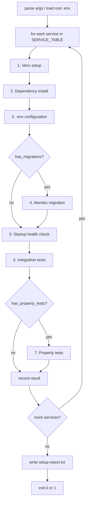

# Design Document: Service Environment Setup

## Overview

`scripts/setup_services.py` is a single Python orchestration script run from the repository root that automates the full environment setup for six microservices: design-service, architectural-service, engineering-service, labor-service, vendor-service, and analytics-service.

The script drives each service through a sequential pipeline: venv creation → dependency installation → `.env` configuration → Alembic migration → startup health check → integration tests → property tests. It produces a consolidated `setup-report.txt` at the end.

The script is designed to be idempotent: re-running it on a service that is already set up should detect the existing venv, skip recreation, and proceed through the remaining steps.

---

## Architecture

The script is structured as a single-file orchestrator with no external dependencies beyond the Python standard library and `httpx` (which is installed into each service's venv, not the script's own environment). All subprocess calls use the service-specific venv Python/pip executables.



Each service runs sequentially. A failure in any step marks the service as `FAILED` and skips remaining steps for that service, but the script continues to the next service.

---

## Components and Interfaces

### SERVICE_TABLE

A dictionary keyed by service name, holding all per-service configuration:

```python
SERVICE_TABLE = {
    "design-service": ServiceConfig(
        port=8004,
        db_scheme="mysql+pymysql",
        has_migrations=True,
        has_redis=True,
        has_celery=True,
        local_packages=[],
        has_property_tests=False,
    ),
    "architectural-service": ServiceConfig(
        port=8007,
        db_scheme="mysql+asyncmy",
        has_migrations=True,
        has_redis=False,
        has_celery=False,
        local_packages=[],
        has_property_tests=True,
    ),
    "engineering-service": ServiceConfig(
        port=8008,
        db_scheme="mysql+asyncmy",
        has_migrations=True,
        has_redis=False,
        has_celery=False,
        local_packages=[],
        has_property_tests=True,
    ),
    "labor-service": ServiceConfig(
        port=8006,
        db_scheme="mysql+pymysql",
        has_migrations=True,
        has_redis=True,
        has_celery=False,
        local_packages=[],
        has_property_tests=True,
    ),
    "vendor-service": ServiceConfig(
        port=8005,
        db_scheme="mysql+pymysql",
        has_migrations=True,
        has_redis=False,
        has_celery=False,
        local_packages=[
            "packages/common/config",
            "packages/common/auth",
            "packages/common/errors",
            "packages/common/monitoring",
            "packages/common/testing",
            "packages/common/storage",
            "packages/common/http",
        ],
        has_property_tests=False,
    ),
    "analytics-service": ServiceConfig(
        port=8009,
        db_scheme="mysql+pymysql",   # set after psycopg2 resolution
        has_migrations=False,         # no alembic.ini present
        has_redis=False,
        has_celery=False,
        local_packages=[],
        has_property_tests=False,
    ),
}
```

`ServiceConfig` is a `dataclass` or `NamedTuple`.

### ServiceResult

Tracks the outcome of each pipeline step per service:

```python
@dataclass
class ServiceResult:
    service: str
    venv_status: StepStatus          # OK | FAILED | SKIPPED
    deps_status: StepStatus
    env_status: StepStatus
    migration_status: StepStatus
    startup_status: StepStatus
    integration_status: StepStatus   # OK | FAILED | SKIPPED
    property_status: StepStatus      # OK | FAILED | SKIPPED
    errors: list[str]                # human-readable failure messages

    @property
    def overall(self) -> Literal["READY", "FAILED"]:
        failed = [s for s in self._step_statuses() if s == StepStatus.FAILED]
        return "FAILED" if failed else "READY"
```

### Core Functions

| Function | Responsibility |
|---|---|
| `load_root_env(path)` | Parse root `.env`, return dict; raise if TiDB keys missing |
| `build_database_url(config, env_vars)` | Construct per-service DATABASE_URL from root env + scheme |
| `ensure_venv(service_dir)` | Create or verify venv; recreate if broken |
| `install_dependencies(service_dir, config)` | pip upgrade, local packages, requirements.txt, dev requirements |
| `configure_env(service_dir, config, db_url, root_env)` | Write/update service .env |
| `run_migrations(service_dir, db_url, venv_python)` | alembic upgrade head + verify |
| `verify_startup(service_dir, config, venv_python)` | Start uvicorn, poll /health, terminate |
| `run_integration_tests(service_dir, db_url, venv_python)` | pytest tests/integration/ |
| `run_property_tests(service_dir, db_url, venv_python)` | pytest tests/property/ with HYPOTHESIS_MAX_EXAMPLES=50 |
| `write_report(results, path)` | Write setup-report.txt and print to stdout |

### Subprocess Conventions

All subprocess calls use `subprocess.run(cmd, cwd=service_dir, env=merged_env, capture_output=True, text=True)`. The `merged_env` is always `os.environ.copy()` with any overrides applied (e.g., `DATABASE_URL`). This ensures the child process inherits PATH and other system variables.

On Windows, venv executables are at `.venv/Scripts/python.exe` and `.venv/Scripts/pip.exe`.

---

## Data Models

### Root .env Required Keys

The script reads these keys from the root `.env`:

| Key | Used for |
|---|---|
| `DB_HOST` | TiDB hostname |
| `DB_PORT` | TiDB port (4000) |
| `DB_USERNAME` | TiDB username |
| `DB_PASSWORD` | TiDB password |
| `DB_DATABASE` | TiDB database name |
| `DB_SSL_CA` | Path to CA certificate (e.g., `./ca.pem`) |

The constructed DATABASE_URL format:
```
{scheme}://{DB_USERNAME}:{DB_PASSWORD}@{DB_HOST}:{DB_PORT}/{DB_DATABASE}?ssl_ca={DB_SSL_CA}&ssl_verify_cert=true&ssl_verify_identity=true
```

### Per-Service .env Update Logic

The script reads the existing service `.env` into a dict, updates/adds the relevant keys, then writes it back — preserving all other keys. For labor-service specifically, the existing `DATABASE_URL=sqlite:///labor_service.db` line is replaced.

Keys written per service:

| Key | Condition |
|---|---|
| `DATABASE_URL` | Always |
| `REDIS_URL` | `has_redis=True` and not already set |
| `CELERY_BROKER_URL` | `has_celery=True` and not already set |
| `CELERY_RESULT_BACKEND` | `has_celery=True` and not already set |

### Analytics-Service Special Handling

The script inspects `apps/analytics-service/requirements.txt` for `psycopg2-binary`. If found:
1. Logs a blocking warning: `"analytics-service: psycopg2-binary detected — resolve before proceeding (replace with pymysql or provide ANALYTICS_DATABASE_URL)"`
2. Checks for `ANALYTICS_DATABASE_URL` in the environment as a fallback
3. If neither resolved, marks analytics-service `env_status=FAILED` and skips remaining steps

### knowledge-service Special Handling (not in scope but referenced)

Although knowledge-service is not in the six target services, the `install_dependencies` function includes a general hook: if a service config has `pre_install_torch_cpu=True`, it runs `pip install torch --index-url https://download.pytorch.org/whl/cpu` before the main requirements install.

### Conftest Updates Required for TiDB Integration Tests

Several services have conftests that hardcode SQLite. For integration tests to run against TiDB, the conftest must read `DATABASE_URL` from the environment. The required changes per service:

**design-service** (`tests/conftest.py`): Already supports `TEST_DATABASE_URL` env var — no change needed. The script sets `TEST_DATABASE_URL` (not `DATABASE_URL`) when invoking pytest for this service.

**architectural-service** (`tests/conftest.py`): Hardcodes `sqlite+aiosqlite:///test_architectural.db`. Needs update to read `TEST_DATABASE_URL` from env and use it when set, falling back to SQLite. The script sets `TEST_DATABASE_URL=mysql+asyncmy://...` when invoking pytest.

**engineering-service** (`tests/conftest.py`): Hardcodes `sqlite+aiosqlite:///:memory:`. Needs update to read `TEST_DATABASE_URL` from env. The script sets `TEST_DATABASE_URL=mysql+asyncmy://...`.

**labor-service** (`tests/conftest.py`): Hardcodes `DATABASE_URL=sqlite:///./test_labor_service.db` via `os.environ` at module level. Needs update: only set the SQLite default if `DATABASE_URL` is not already in the environment. The script sets `DATABASE_URL` before invoking pytest, which will override the default.

**vendor-service** (`tests/conftest.py`): Already supports `TEST_DATABASE_URL` env var via `create_test_engine` — no change needed.

**analytics-service**: No integration tests directory exists yet.

The script passes `TEST_DATABASE_URL` for services that use that variable, and `DATABASE_URL` for services that read `DATABASE_URL` directly (labor-service).

---

## Correctness Properties

*A property is a characteristic or behavior that should hold true across all valid executions of a system — essentially, a formal statement about what the system should do. Properties serve as the bridge between human-readable specifications and machine-verifiable correctness guarantees.*

### Property 1: Venv pip path isolation

*For any* service name in SERVICE_TABLE, every `pip install` subprocess call made during that service's setup must use the pip executable path `apps/{service}/.venv/Scripts/pip.exe` — never a system pip or another service's pip.

**Validates: Requirements 1.4**

### Property 2: pip upgrade precedes all installs

*For any* service, the `pip install --upgrade pip` call must appear before any other `pip install` call in the sequence of subprocess invocations for that service.

**Validates: Requirements 2.6**

### Property 3: DATABASE_URL scheme matches driver config

*For any* service in SERVICE_TABLE, the `DATABASE_URL` written to the service `.env` must begin with the scheme specified in that service's `db_scheme` field (e.g., `mysql+asyncmy://` for architectural-service and engineering-service, `mysql+pymysql://` for all others).

**Validates: Requirements 3.1, 3.3**

### Property 4: Non-database .env keys are preserved

*For any* service `.env` file with arbitrary existing key-value pairs, after the script updates `DATABASE_URL`, all keys that are not `DATABASE_URL`, `REDIS_URL`, `CELERY_BROKER_URL`, or `CELERY_RESULT_BACKEND` must be present in the updated file with their original values unchanged.

**Validates: Requirements 3.7**

### Property 5: Redis and Celery vars set for applicable services

*For any* service where `has_redis=True`, the resulting `.env` must contain `REDIS_URL`. *For any* service where `has_celery=True`, the resulting `.env` must contain both `CELERY_BROKER_URL` and `CELERY_RESULT_BACKEND`.

**Validates: Requirements 3.5, 3.6**

### Property 6: Migration subprocess always receives DATABASE_URL override

*For any* service that has migrations, the `alembic upgrade head` subprocess call must include `DATABASE_URL` set to the TiDB connection string in its environment, regardless of what is in `alembic.ini`.

**Validates: Requirements 5.2, 5.3**

### Property 7: Correct port used for each service startup

*For any* service name in SERVICE_TABLE, the uvicorn startup command must use the port number defined in that service's config entry. The port map is: design-service=8004, architectural-service=8007, engineering-service=8008, labor-service=8006, vendor-service=8005, analytics-service=8009.

**Validates: Requirements 6.6**

### Property 8: Service process is always terminated after health check

*For any* service, regardless of whether the health check passes or fails (or times out), the uvicorn subprocess must be terminated before the script proceeds to the next step.

**Validates: Requirements 6.5**

### Property 9: Integration test subprocess always receives DATABASE_URL

*For any* service with an integration test directory, the pytest subprocess call must include `DATABASE_URL` (or `TEST_DATABASE_URL` for services that use that variable) set to the TiDB connection string in its environment.

**Validates: Requirements 7.2**

### Property 10: Property tests receive HYPOTHESIS_MAX_EXAMPLES=50

*For any* service with a `tests/property/` directory, the pytest subprocess call must include `HYPOTHESIS_MAX_EXAMPLES=50` in its environment.

**Validates: Requirements 8.2**

### Property 11: READY status requires all applicable steps to pass

*For any* service result, the overall status is `READY` if and only if every applicable step status is `OK` (steps that are `SKIPPED` due to the service not having that feature do not count as failures).

**Validates: Requirements 9.2**

### Property 12: FAILED status includes first failing step

*For any* service result where overall status is `FAILED`, the error list must be non-empty and the first error must identify the step that failed first in pipeline order.

**Validates: Requirements 9.3**

---

## Error Handling

| Failure scenario | Behavior |
|---|---|
| Root `.env` missing or missing TiDB keys | Halt entire script immediately, print which keys are absent |
| Venv verification returns non-zero | Delete venv, recreate; if recreation fails, mark service FAILED |
| Any `pip install` returns non-zero | Log full pip stderr, mark service FAILED, skip remaining steps |
| `alembic upgrade head` returns non-zero | Log full alembic output, mark service FAILED, skip remaining steps |
| `alembic current` output missing `(head)` | Log output, mark migration step FAILED |
| Service does not start within 30s | Terminate process, mark startup FAILED |
| Health check returns non-200 | Log response body, mark startup FAILED |
| pytest exits non-zero | Parse output for FAILED/ERROR counts, log tracebacks, mark test step FAILED but continue to next step |
| analytics-service psycopg2 detected, no fallback | Mark env_status FAILED, skip migration/startup/tests |
| `tests/integration/` or `tests/property/` absent | Log skip, mark step SKIPPED (not FAILED) |

All errors are accumulated in `ServiceResult.errors` and included in the final report.

---

## Testing Strategy

### Unit Tests

Unit tests cover the pure functions in the script that can be tested without subprocess calls:

- `build_database_url`: given various `ServiceConfig` and env dicts, assert the correct URL scheme and query params
- `load_root_env`: given a file with missing keys, assert the correct exception is raised
- `parse_env_file` / `write_env_file`: round-trip test — parse then write then parse again should produce identical dict
- `ServiceResult.overall`: given various combinations of step statuses, assert READY vs FAILED
- Port lookup: given each service name, assert the correct port is returned
- psycopg2 detection: given requirements.txt content with/without psycopg2-binary, assert detection result

### Property-Based Tests (Hypothesis)

Each property from the Correctness Properties section is implemented as a Hypothesis test. Configuration:
- Library: `hypothesis`
- Minimum iterations: 100 per property
- Tag format in test comments: `# Feature: service-environment-setup, Property {N}: {property_text}`

Key generators needed:
- `service_names()`: `st.sampled_from(list(SERVICE_TABLE.keys()))`
- `env_file_contents()`: `st.dictionaries(st.text(min_size=1), st.text())` — arbitrary key-value pairs
- `step_status_combos()`: `st.lists(st.sampled_from(StepStatus), min_size=7, max_size=7)`

Property tests mock `subprocess.run` using `unittest.mock.patch` so no real processes are spawned.

### Integration Tests

Integration tests (run manually, not part of CI by default) verify the script against the real TiDB instance:
- Run the script against a single service with `--service design-service --dry-run` flag
- Verify the generated `.env` contains a valid TiDB URL
- Verify `setup-report.txt` is written with the correct structure

### Property Test Configuration

```python
# Feature: service-environment-setup, Property 3: DATABASE_URL scheme matches driver config
@given(service_name=service_names())
@settings(max_examples=100)
def test_database_url_scheme_matches_driver(service_name):
    config = SERVICE_TABLE[service_name]
    url = build_database_url(config, SAMPLE_ENV_VARS)
    assert url.startswith(config.db_scheme + "://")
```
