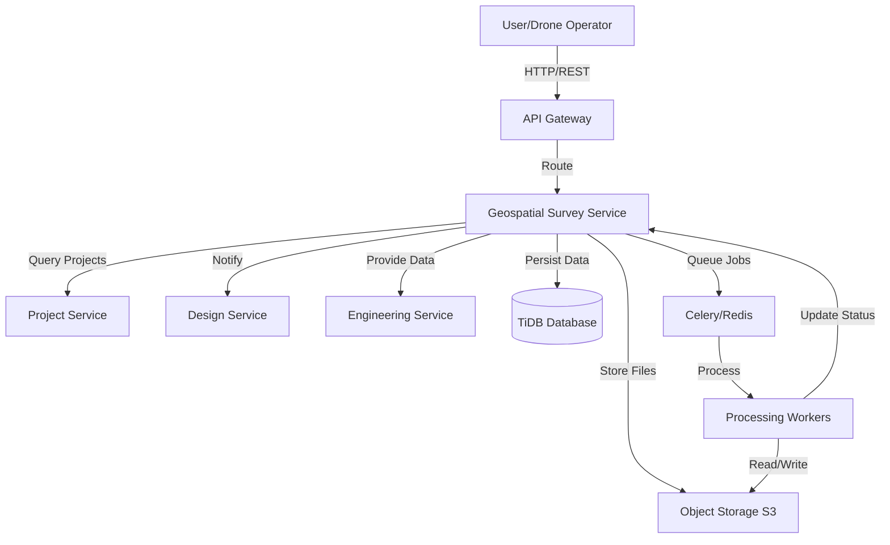

# Design Document: Geospatial Survey Service

## Overview

The Geospatial Survey Service is a FastAPI-based microservice that manages the complete lifecycle of UAV-based site surveys for construction projects. It provides capabilities for flight mission planning, aerial data capture tracking, photogrammetry processing, terrain analysis, and integration with design and engineering workflows.

### Key Design Principles

1. **Asynchronous Processing**: Long-running photogrammetry jobs are handled via Celery task queues
2. **Scalable Storage**: Large imagery and 3D model files are stored in object storage (S3-compatible)
3. **Geospatial Standards**: Adherence to OGC standards for coordinate systems and data formats
4. **Microservice Integration**: RESTful APIs for communication with Project, Design, and Engineering services
5. **Regulatory Compliance**: Built-in validation for FAA Part 107 and airspace restrictions
6. **TDD Approach**: Property-based testing with Hypothesis for correctness validation

## Architecture

### System Context



### Service Architecture

The service follows a layered architecture pattern:

1. **API Layer** (`src/api/v1/routes/`): FastAPI route handlers for REST endpoints
2. **Service Layer** (`src/services/`): Business logic and orchestration
3. **Repository Layer** (`src/repositories/`): Data access and persistence
4. **Model Layer** (`src/models/`): SQLAlchemy ORM models
5. **Task Layer** (`src/tasks/`): Celery background tasks for processing
6. **Client Layer** (`src/clients/`): HTTP clients for external service communication

### Technology Stack

- **Framework**: FastAPI 0.104+
- **Database**: TiDB (MySQL-compatible)
- **ORM**: SQLAlchemy 2.0+
- **Task Queue**: Celery with Redis broker
- **Storage**: S3-compatible object storage
- **Geospatial**: GDAL, Rasterio, Shapely for spatial operations
- **Testing**: Pytest, Hypothesis for property-based testing
- **Authentication**: JWT tokens from User Service

## Components and Interfaces

### API Endpoints

#### Flight Missions

```
POST   /api/v1/missions                    - Create flight mission
GET    /api/v1/missions                    - List missions for project
GET    /api/v1/missions/{mission_id}       - Get mission details
PUT    /api/v1/missions/{mission_id}       - Update mission
DELETE /api/v1/missions/{mission_id}       - Delete mission
POST   /api/v1/missions/{mission_id}/validate - Validate mission parameters
GET    /api/v1/missions/{mission_id}/flight-path - Get calculated flight path
```

#### Flight Logs

```
POST   /api/v1/flight-logs                 - Create flight log
GET    /api/v1/flight-logs                 - List flight logs
GET    /api/v1/flight-logs/{log_id}        - Get flight log details
POST   /api/v1/flight-logs/{log_id}/images - Upload captured images
GET    /api/v1/flight-logs/{log_id}/coverage - Get coverage analysis
```

#### Photogrammetry Jobs

```
POST   /api/v1/photogrammetry              - Submit processing job
GET    /api/v1/photogrammetry              - List jobs
GET    /api/v1/photogrammetry/{job_id}     - Get job status
DELETE /api/v1/photogrammetry/{job_id}     - Cancel job
GET    /api/v1/photogrammetry/{job_id}/outputs - Get processed outputs
POST   /api/v1/photogrammetry/{job_id}/gcps - Add ground control points
```

#### Terrain Analysis

```
POST   /api/v1/terrain/analysis            - Request terrain analysis
GET    /api/v1/terrain/analysis/{analysis_id} - Get analysis results
POST   /api/v1/terrain/cut-fill            - Calculate cut/fill volumes
POST   /api/v1/terrain/contours            - Generate contour lines
POST   /api/v1/terrain/cross-sections      - Extract cross-sections
GET    /api/v1/terrain/elevation           - Query elevation at points
```

#### Site Comparisons

```
POST   /api/v1/comparisons                 - Create site comparison
GET    /api/v1/comparisons                 - List comparisons
GET    /api/v1/comparisons/{comparison_id} - Get comparison results
GET    /api/v1/comparisons/{comparison_id}/changes - Get change detection
GET    /api/v1/comparisons/{comparison_id}/volumes - Get volume changes
```

#### Surveys (Top-level resource)

```
POST   /api/v1/surveys                     - Create survey record
GET    /api/v1/surveys                     - List surveys for project
GET    /api/v1/surveys/{survey_id}         - Get survey details
PUT    /api/v1/surveys/{survey_id}         - Update survey
DELETE /api/v1/surveys/{survey_id}         - Delete survey
GET    /api/v1/surveys/{survey_id}/exports - Export survey data
```

### Service Layer Components

#### MissionPlanningService

Handles flight mission creation, validation, and path calculation.

**Key Methods:**
- `create_mission(project_id, area, altitude, overlap) -> Mission`
- `validate_mission(mission) -> ValidationResult`
- `calculate_flight_path(mission) -> FlightPath`
- `check_airspace_restrictions(area) -> AirspaceStatus`
- `estimate_flight_time(mission) -> Duration`

#### FlightDataService

Manages flight execution tracking and data capture.

**Key Methods:**
- `create_flight_log(mission_id, telemetry) -> FlightLog`
- `add_captured_image(log_id, image, metadata) -> CapturedImage`
- `validate_coverage(log_id) -> CoverageReport`
- `analyze_image_quality(images) -> QualityReport`

#### PhotogrammetryService

Orchestrates photogrammetry processing workflows.

**Key Methods:**
- `submit_job(flight_log_id, parameters) -> PhotogrammetryJob`
- `add_ground_control_points(job_id, gcps) -> Job`
- `get_job_status(job_id) -> JobStatus`
- `get_outputs(job_id) -> ProcessedOutputs`
- `cancel_job(job_id) -> bool`

#### TerrainAnalysisService

Performs terrain calculations and analysis.

**Key Methods:**
- `analyze_terrain(dem_id, parameters) -> TerrainAnalysis`
- `calculate_cut_fill(dem_id, design_surface) -> CutFillVolumes`
- `generate_contours(dem_id, interval) -> Contours`
- `extract_cross_section(dem_id, path) -> CrossSection`
- `query_elevation(dem_id, points) -> Elevations`

#### SiteComparisonService

Handles temporal comparison and change detection.

**Key Methods:**
- `create_comparison(survey_id_1, survey_id_2) -> Comparison`
- `detect_changes(comparison_id) -> ChangeDetection`
- `calculate_volume_changes(comparison_id) -> VolumeChanges`
- `generate_comparison_report(comparison_id) -> Report`

#### IntegrationService

Manages communication with other microservices.

**Key Methods:**
- `notify_design_service(survey_id) -> bool`
- `get_project_details(project_id) -> Project`
- `export_for_cad(survey_id, format) -> ExportFile`
- `provide_terrain_to_engineering(survey_id) -> TerrainData`

### Background Tasks (Celery)

#### Photogrammetry Processing Tasks

```python
@celery_app.task
def process_photogrammetry_job(job_id: str):
    """
    Main photogrammetry processing pipeline:
    1. Load images and metadata
    2. Feature detection and matching
    3. Bundle adjustment
    4. Dense reconstruction
    5. Mesh generation
    6. Orthomosaic creation
    7. DEM generation
    8. Quality assessment
    """
```

#### Terrain Analysis Tasks

```python
@celery_app.task
def generate_terrain_products(dem_id: str):
    """
    Generate derived terrain products:
    1. Slope and aspect maps
    2. Hillshade visualization
    3. Contour lines
    4. Drainage analysis
    """
```

#### Change Detection Tasks

```python
@celery_app.task
def perform_change_detection(comparison_id: str):
    """
    Compare two surveys:
    1. Align coordinate systems
    2. Calculate point-to-point differences
    3. Identify significant changes
    4. Generate change maps
    5. Calculate volume differences
    """
```


## Data Models

### Core Models

#### Survey

Represents a complete site survey with associated data products.

```python
class Survey(Base):
    __tablename__ = "surveys"

    id: Mapped[str] = mapped_column(String(36), primary_key=True)
    project_id: Mapped[str] = mapped_column(String(36), ForeignKey("projects.id"), nullable=False, index=True)
    name: Mapped[str] = mapped_column(String(255), nullable=False)
    description: Mapped[Optional[str]] = mapped_column(Text)
    survey_date: Mapped[datetime] = mapped_column(DateTime, nullable=False)
    survey_type: Mapped[str] = mapped_column(String(50), nullable=False)  # baseline, progress, final
    status: Mapped[str] = mapped_column(String(50), nullable=False)  # planned, in_progress, processing, completed, failed

    # Geospatial bounds
    bounds_geojson: Mapped[Optional[str]] = mapped_column(Text)  # GeoJSON polygon
    coordinate_system: Mapped[str] = mapped_column(String(50), default="EPSG:4326")

    # Metadata
    weather_conditions: Mapped[Optional[str]] = mapped_column(Text)  # JSON
    equipment_used: Mapped[Optional[str]] = mapped_column(Text)  # JSON
    pilot_id: Mapped[Optional[str]] = mapped_column(String(36))

    # Relationships
    missions: Mapped[List["FlightMission"]] = relationship(back_populates="survey", cascade="all, delete-orphan")
    flight_logs: Mapped[List["FlightLog"]] = relationship(back_populates="survey", cascade="all, delete-orphan")
    photogrammetry_jobs: Mapped[List["PhotogrammetryJob"]] = relationship(back_populates="survey")
    terrain_analyses: Mapped[List["TerrainAnalysis"]] = relationship(back_populates="survey")

    # Timestamps
    created_at: Mapped[datetime] = mapped_column(DateTime, default=datetime.utcnow)
    updated_at: Mapped[datetime] = mapped_column(DateTime, default=datetime.utcnow, onupdate=datetime.utcnow)
```

#### FlightMission

Represents a planned drone flight mission.

```python
class FlightMission(Base):
    __tablename__ = "flight_missions"

    id: Mapped[str] = mapped_column(String(36), primary_key=True)
    survey_id: Mapped[str] = mapped_column(String(36), ForeignKey("surveys.id"), nullable=False, index=True)
    name: Mapped[str] = mapped_column(String(255), nullable=False)
    status: Mapped[str] = mapped_column(String(50), nullable=False)  # planned, approved, executed, cancelled

    # Flight parameters
    flight_area_geojson: Mapped[str] = mapped_column(Text, nullable=False)  # GeoJSON polygon
    altitude_meters: Mapped[float] = mapped_column(Float, nullable=False)
    speed_mps: Mapped[float] = mapped_column(Float, nullable=False)
    forward_overlap_percent: Mapped[float] = mapped_column(Float, default=70.0)
    side_overlap_percent: Mapped[float] = mapped_column(Float, default=60.0)

    # Camera settings
    camera_model: Mapped[str] = mapped_column(String(100), nullable=False)
    focal_length_mm: Mapped[float] = mapped_column(Float, nullable=False)
    sensor_width_mm: Mapped[float] = mapped_column(Float, nullable=False)
    sensor_height_mm: Mapped[float] = mapped_column(Float, nullable=False)
    image_width_px: Mapped[int] = mapped_column(Integer, nullable=False)
    image_height_px: Mapped[int] = mapped_column(Integer, nullable=False)

    # Calculated flight path
    waypoints_geojson: Mapped[Optional[str]] = mapped_column(Text)  # GeoJSON LineString
    estimated_duration_minutes: Mapped[Optional[float]] = mapped_column(Float)
    estimated_image_count: Mapped[Optional[int]] = mapped_column(Integer)

    # Regulatory compliance
    airspace_authorization: Mapped[Optional[str]] = mapped_column(String(100))
    max_altitude_limit_meters: Mapped[float] = mapped_column(Float, default=120.0)  # FAA Part 107 limit

    # Relationships
    survey: Mapped["Survey"] = relationship(back_populates="missions")
    flight_logs: Mapped[List["FlightLog"]] = relationship(back_populates="mission")

    # Timestamps
    created_at: Mapped[datetime] = mapped_column(DateTime, default=datetime.utcnow)
    updated_at: Mapped[datetime] = mapped_column(DateTime, default=datetime.utcnow, onupdate=datetime.utcnow)
```

#### FlightLog

Records actual flight execution and captured data.

```python
class FlightLog(Base):
    __tablename__ = "flight_logs"

    id: Mapped[str] = mapped_column(String(36), primary_key=True)
    mission_id: Mapped[str] = mapped_column(String(36), ForeignKey("flight_missions.id"), nullable=False, index=True)
    survey_id: Mapped[str] = mapped_column(String(36), ForeignKey("surveys.id"), nullable=False, index=True)

    # Flight execution
    start_time: Mapped[datetime] = mapped_column(DateTime, nullable=False)
    end_time: Mapped[Optional[datetime]] = mapped_column(DateTime)
    status: Mapped[str] = mapped_column(String(50), nullable=False)  # in_progress, completed, aborted, failed

    # Telemetry data (stored as JSON)
    telemetry_data: Mapped[Optional[str]] = mapped_column(Text)  # GPS tracks, altitude, battery

    # Coverage validation
    waypoints_covered: Mapped[Optional[int]] = mapped_column(Integer)
    waypoints_total: Mapped[Optional[int]] = mapped_column(Integer)
    coverage_percent: Mapped[Optional[float]] = mapped_column(Float)

    # Data quality
    images_captured: Mapped[int] = mapped_column(Integer, default=0)
    images_valid: Mapped[Optional[int]] = mapped_column(Integer)
    quality_issues: Mapped[Optional[str]] = mapped_column(Text)  # JSON array of issues

    # Relationships
    mission: Mapped["FlightMission"] = relationship(back_populates="flight_logs")
    survey: Mapped["Survey"] = relationship(back_populates="flight_logs")
    captured_images: Mapped[List["CapturedImage"]] = relationship(back_populates="flight_log", cascade="all, delete-orphan")

    # Timestamps
    created_at: Mapped[datetime] = mapped_column(DateTime, default=datetime.utcnow)
    updated_at: Mapped[datetime] = mapped_column(DateTime, default=datetime.utcnow, onupdate=datetime.utcnow)
```

#### CapturedImage

Represents an individual aerial image with metadata.

```python
class CapturedImage(Base):
    __tablename__ = "captured_images"

    id: Mapped[str] = mapped_column(String(36), primary_key=True)
    flight_log_id: Mapped[str] = mapped_column(String(36), ForeignKey("flight_logs.id"), nullable=False, index=True)

    # Storage
    storage_path: Mapped[str] = mapped_column(String(500), nullable=False)  # S3 path
    file_size_bytes: Mapped[int] = mapped_column(BigInteger, nullable=False)
    file_format: Mapped[str] = mapped_column(String(20), nullable=False)  # JPEG, RAW, TIFF

    # Capture metadata
    capture_time: Mapped[datetime] = mapped_column(DateTime, nullable=False)
    latitude: Mapped[float] = mapped_column(Float, nullable=False)
    longitude: Mapped[float] = mapped_column(Float, nullable=False)
    altitude_meters: Mapped[float] = mapped_column(Float, nullable=False)

    # Camera parameters
    gimbal_roll: Mapped[Optional[float]] = mapped_column(Float)
    gimbal_pitch: Mapped[Optional[float]] = mapped_column(Float)
    gimbal_yaw: Mapped[Optional[float]] = mapped_column(Float)

    # EXIF data (stored as JSON)
    exif_data: Mapped[Optional[str]] = mapped_column(Text)

    # Quality assessment
    quality_score: Mapped[Optional[float]] = mapped_column(Float)  # 0-100
    blur_score: Mapped[Optional[float]] = mapped_column(Float)
    exposure_score: Mapped[Optional[float]] = mapped_column(Float)

    # Relationships
    flight_log: Mapped["FlightLog"] = relationship(back_populates="captured_images")

    # Timestamps
    created_at: Mapped[datetime] = mapped_column(DateTime, default=datetime.utcnow)
```

#### PhotogrammetryJob

Represents a photogrammetry processing job.

```python
class PhotogrammetryJob(Base):
    __tablename__ = "photogrammetry_jobs"

    id: Mapped[str] = mapped_column(String(36), primary_key=True)
    survey_id: Mapped[str] = mapped_column(String(36), ForeignKey("surveys.id"), nullable=False, index=True)
    flight_log_id: Mapped[str] = mapped_column(String(36), ForeignKey("flight_logs.id"), nullable=False, index=True)

    # Job configuration
    processing_preset: Mapped[str] = mapped_column(String(50), nullable=False)  # fast, balanced, high_quality
    output_formats: Mapped[str] = mapped_column(String(200), nullable=False)  # Comma-separated: point_cloud,mesh,orthomosaic,dem

    # Processing status
    status: Mapped[str] = mapped_column(String(50), nullable=False)  # queued, processing, completed, failed, cancelled
    progress_percent: Mapped[float] = mapped_column(Float, default=0.0)
    current_stage: Mapped[Optional[str]] = mapped_column(String(100))

    # Processing parameters
    use_gcps: Mapped[bool] = mapped_column(Boolean, default=False)
    target_gsd_cm: Mapped[Optional[float]] = mapped_column(Float)  # Ground Sample Distance

    # Results
    point_cloud_path: Mapped[Optional[str]] = mapped_column(String(500))
    mesh_path: Mapped[Optional[str]] = mapped_column(String(500))
    orthomosaic_path: Mapped[Optional[str]] = mapped_column(String(500))
    dem_path: Mapped[Optional[str]] = mapped_column(String(500))

    # Quality metrics
    reprojection_error: Mapped[Optional[float]] = mapped_column(Float)
    point_count: Mapped[Optional[int]] = mapped_column(BigInteger)
    ground_resolution_cm: Mapped[Optional[float]] = mapped_column(Float)

    # Processing time
    started_at: Mapped[Optional[datetime]] = mapped_column(DateTime)
    completed_at: Mapped[Optional[datetime]] = mapped_column(DateTime)
    processing_duration_seconds: Mapped[Optional[int]] = mapped_column(Integer)

    # Error handling
    error_message: Mapped[Optional[str]] = mapped_column(Text)
    retry_count: Mapped[int] = mapped_column(Integer, default=0)

    # Relationships
    survey: Mapped["Survey"] = relationship(back_populates="photogrammetry_jobs")
    ground_control_points: Mapped[List["GroundControlPoint"]] = relationship(back_populates="job", cascade="all, delete-orphan")

    # Timestamps
    created_at: Mapped[datetime] = mapped_column(DateTime, default=datetime.utcnow)
    updated_at: Mapped[datetime] = mapped_column(DateTime, default=datetime.utcnow, onupdate=datetime.utcnow)
```

#### GroundControlPoint

Represents surveyed ground control points for georeferencing.

```python
class GroundControlPoint(Base):
    __tablename__ = "ground_control_points"

    id: Mapped[str] = mapped_column(String(36), primary_key=True)
    job_id: Mapped[str] = mapped_column(String(36), ForeignKey("photogrammetry_jobs.id"), nullable=False, index=True)

    # GCP identification
    name: Mapped[str] = mapped_column(String(100), nullable=False)
    marker_type: Mapped[str] = mapped_column(String(50), nullable=False)  # checkerboard, cross, natural_feature

    # Surveyed coordinates
    latitude: Mapped[float] = mapped_column(Float, nullable=False)
    longitude: Mapped[float] = mapped_column(Float, nullable=False)
    elevation_meters: Mapped[float] = mapped_column(Float, nullable=False)
    coordinate_system: Mapped[str] = mapped_column(String(50), default="EPSG:4326")

    # Accuracy
    horizontal_accuracy_meters: Mapped[Optional[float]] = mapped_column(Float)
    vertical_accuracy_meters: Mapped[Optional[float]] = mapped_column(Float)

    # Image associations
    image_coordinates: Mapped[Optional[str]] = mapped_column(Text)  # JSON: {image_id: {x, y}}

    # Relationships
    job: Mapped["PhotogrammetryJob"] = relationship(back_populates="ground_control_points")

    # Timestamps
    created_at: Mapped[datetime] = mapped_column(DateTime, default=datetime.utcnow)
```

#### TerrainAnalysis

Stores terrain analysis results.

```python
class TerrainAnalysis(Base):
    __tablename__ = "terrain_analyses"

    id: Mapped[str] = mapped_column(String(36), primary_key=True)
    survey_id: Mapped[str] = mapped_column(String(36), ForeignKey("surveys.id"), nullable=False, index=True)
    dem_path: Mapped[str] = mapped_column(String(500), nullable=False)

    # Analysis type
    analysis_type: Mapped[str] = mapped_column(String(50), nullable=False)  # slope, aspect, contours, cut_fill, drainage

    # Parameters (stored as JSON)
    parameters: Mapped[str] = mapped_column(Text, nullable=False)

    # Results
    result_path: Mapped[Optional[str]] = mapped_column(String(500))
    result_data: Mapped[Optional[str]] = mapped_column(Text)  # JSON for small results

    # Statistics
    min_value: Mapped[Optional[float]] = mapped_column(Float)
    max_value: Mapped[Optional[float]] = mapped_column(Float)
    mean_value: Mapped[Optional[float]] = mapped_column(Float)
    std_dev: Mapped[Optional[float]] = mapped_column(Float)

    # Status
    status: Mapped[str] = mapped_column(String(50), nullable=False)  # queued, processing, completed, failed

    # Relationships
    survey: Mapped["Survey"] = relationship(back_populates="terrain_analyses")

    # Timestamps
    created_at: Mapped[datetime] = mapped_column(DateTime, default=datetime.utcnow)
    completed_at: Mapped[Optional[datetime]] = mapped_column(DateTime)
```

#### SiteComparison

Represents a temporal comparison between two surveys.

```python
class SiteComparison(Base):
    __tablename__ = "site_comparisons"

    id: Mapped[str] = mapped_column(String(36), primary_key=True)
    project_id: Mapped[str] = mapped_column(String(36), nullable=False, index=True)

    # Surveys being compared
    baseline_survey_id: Mapped[str] = mapped_column(String(36), ForeignKey("surveys.id"), nullable=False)
    current_survey_id: Mapped[str] = mapped_column(String(36), ForeignKey("surveys.id"), nullable=False)

    # Comparison metadata
    name: Mapped[str] = mapped_column(String(255), nullable=False)
    description: Mapped[Optional[str]] = mapped_column(Text)
    comparison_type: Mapped[str] = mapped_column(String(50), nullable=False)  # progress, change_detection, volume_analysis

    # Processing status
    status: Mapped[str] = mapped_column(String(50), nullable=False)  # queued, processing, completed, failed

    # Results
    change_map_path: Mapped[Optional[str]] = mapped_column(String(500))
    volume_changes: Mapped[Optional[str]] = mapped_column(Text)  # JSON
    significant_changes: Mapped[Optional[str]] = mapped_column(Text)  # JSON array

    # Volume calculations
    cut_volume_m3: Mapped[Optional[float]] = mapped_column(Float)
    fill_volume_m3: Mapped[Optional[float]] = mapped_column(Float)
    net_volume_m3: Mapped[Optional[float]] = mapped_column(Float)

    # Change statistics
    area_changed_m2: Mapped[Optional[float]] = mapped_column(Float)
    max_elevation_change_m: Mapped[Optional[float]] = mapped_column(Float)
    mean_elevation_change_m: Mapped[Optional[float]] = mapped_column(Float)

    # Timestamps
    created_at: Mapped[datetime] = mapped_column(DateTime, default=datetime.utcnow)
    completed_at: Mapped[Optional[datetime]] = mapped_column(DateTime)
```

### Supporting Models

#### PilotCertification

Tracks drone pilot certifications for regulatory compliance.

```python
class PilotCertification(Base):
    __tablename__ = "pilot_certifications"

    id: Mapped[str] = mapped_column(String(36), primary_key=True)
    user_id: Mapped[str] = mapped_column(String(36), nullable=False, index=True)

    # Certification details
    certification_type: Mapped[str] = mapped_column(String(50), nullable=False)  # part_107, part_61, etc.
    certificate_number: Mapped[str] = mapped_column(String(100), nullable=False, unique=True)
    issuing_authority: Mapped[str] = mapped_column(String(100), nullable=False)

    # Validity
    issue_date: Mapped[date] = mapped_column(Date, nullable=False)
    expiration_date: Mapped[date] = mapped_column(Date, nullable=False)
    is_active: Mapped[bool] = mapped_column(Boolean, default=True)

    # Timestamps
    created_at: Mapped[datetime] = mapped_column(DateTime, default=datetime.utcnow)
    updated_at: Mapped[datetime] = mapped_column(DateTime, default=datetime.utcnow, onupdate=datetime.utcnow)
```

#### DroneRegistration

Tracks registered drones for regulatory compliance.

```python
class DroneRegistration(Base):
    __tablename__ = "drone_registrations"

    id: Mapped[str] = mapped_column(String(36), primary_key=True)

    # Drone details
    manufacturer: Mapped[str] = mapped_column(String(100), nullable=False)
    model: Mapped[str] = mapped_column(String(100), nullable=False)
    serial_number: Mapped[str] = mapped_column(String(100), nullable=False, unique=True)

    # Registration
    registration_number: Mapped[str] = mapped_column(String(100), nullable=False, unique=True)
    registration_date: Mapped[date] = mapped_column(Date, nullable=False)
    expiration_date: Mapped[date] = mapped_column(Date, nullable=False)

    # Specifications
    weight_grams: Mapped[float] = mapped_column(Float, nullable=False)
    max_flight_time_minutes: Mapped[Optional[float]] = mapped_column(Float)

    # Status
    is_active: Mapped[bool] = mapped_column(Boolean, default=True)

    # Timestamps
    created_at: Mapped[datetime] = mapped_column(DateTime, default=datetime.utcnow)
    updated_at: Mapped[datetime] = mapped_column(DateTime, default=datetime.utcnow, onupdate=datetime.utcnow)
```


## Correctness Properties

A property is a characteristic or behavior that should hold true across all valid executions of a system—essentially, a formal statement about what the system should do. Properties serve as the bridge between human-readable specifications and machine-verifiable correctness guarantees.

### Property 1: Mission Regulatory Compliance

*For any* flight mission with specified parameters and flight area, the validation system should reject missions that violate FAA Part 107 regulations including altitude limits (400ft AGL), controlled airspace restrictions, visual line-of-sight requirements, or intersect with restricted airspace zones.

**Validates: Requirements 1.1, 1.5, 8.1, 8.2, 8.7**

### Property 2: Flight Path Coverage and Overlap

*For any* flight area and specified overlap percentages, the calculated flight path should completely cover the area and maintain at least the specified forward and side overlap percentages (minimum 60% forward, 40% side for photogrammetry), with waypoints spaced to achieve the target ground sample distance.

**Validates: Requirements 1.2, 1.6**

### Property 3: Flight Duration Estimation Reasonableness

*For any* valid mission parameters including flight area, altitude, and speed, the estimated flight duration and battery requirements should be positive values and proportional to the flight path length divided by speed, accounting for takeoff, landing, and turn time.

**Validates: Requirements 1.3**

### Property 4: Data Persistence Round-Trip

*For any* survey entity (mission, flight log, captured image, photogrammetry job, terrain analysis, or comparison), storing the entity and then retrieving it by ID should return an equivalent entity with all required fields and relationships intact.

**Validates: Requirements 1.4, 2.4, 8.3, 9.1**

### Property 5: Telemetry Data Completeness

*For any* flight log created during mission execution, the telemetry data should contain GPS coordinates, altitude values, and timestamps for all recorded points, with timestamps monotonically increasing and coordinates within valid geographic bounds.

**Validates: Requirements 2.1**

### Property 6: Image Metadata Association

*For any* captured image stored in the system, the image should have associated capture location (latitude, longitude, altitude), capture timestamp, and camera parameters (focal length, sensor dimensions), with all values within valid ranges.

**Validates: Requirements 2.2**

### Property 7: Mission Coverage Validation

*For any* completed flight mission, the coverage percentage should equal (waypoints_covered / waypoints_total) * 100, and should be flagged as incomplete if coverage is below 95%.

**Validates: Requirements 2.3**

### Property 8: Image Quality Flagging

*For any* set of captured images, images with blur scores below threshold, exposure scores outside acceptable range, or missing geolocation data should be flagged as having quality issues, and the flight log should reflect the count of valid vs invalid images.

**Validates: Requirements 2.5**

### Property 9: Flight Status Progression

*For any* flight log, status transitions should follow the valid state machine: planned → in_progress → (completed | aborted | failed), with timestamps showing start_time < end_time when completed.

**Validates: Requirements 2.6**

### Property 10: Photogrammetry Job Input Validation

*For any* photogrammetry job submission, the system should reject jobs where image count is below minimum threshold (typically 5 images), images lack geolocation data, or calculated overlap between images is insufficient for reconstruction.

**Validates: Requirements 3.1**

### Property 11: Processing Output Generation

*For any* successfully completed photogrammetry job with requested output formats, all requested formats (point_cloud, mesh, orthomosaic, dem) should have corresponding output file paths stored, and files should exist in object storage.

**Validates: Requirements 3.2, 3.7**

### Property 12: Ground Control Point Accuracy Improvement

*For any* photogrammetry job, if ground control points are provided, the reprojection error should be lower than the same job processed without GCPs, demonstrating improved georeferencing accuracy.

**Validates: Requirements 3.3**

### Property 13: Processing Progress Monotonicity

*For any* photogrammetry job in processing status, progress_percent should increase monotonically from 0 to 100, never decreasing, and should reach 100 when status transitions to completed.

**Validates: Requirements 3.4**

### Property 14: Processing Accuracy Metrics Presence

*For any* completed photogrammetry job, accuracy metrics including reprojection_error, point_count, and ground_resolution_cm should be present and within reasonable bounds (error < 10 pixels, point_count > 0, resolution > 0).

**Validates: Requirements 3.5**

### Property 15: Processing Failure Diagnostics

*For any* photogrammetry job with status "failed", the error_message field should be non-empty and contain diagnostic information about the failure cause.

**Validates: Requirements 3.6**

### Property 16: Terrain Statistics Validity

*For any* DEM-based terrain analysis, calculated statistics (slope, aspect, elevation) should be within valid ranges: slope [0°, 90°], aspect [0°, 360°], elevation within DEM bounds, with mean values between min and max.

**Validates: Requirements 4.1**

### Property 17: Cut-Fill Volume Conservation

*For any* cut-fill analysis between a DEM and design surface, the sum of cut_volume_m3 and fill_volume_m3 should equal the absolute value of net_volume_m3, and all volumes should be non-negative.

**Validates: Requirements 4.2**

### Property 18: Contour Interval Consistency

*For any* contour generation request with specified interval, the elevation difference between adjacent contour lines should equal the specified interval (within numerical tolerance), and contours should not intersect.

**Validates: Requirements 4.3**

### Property 19: Drainage Network Connectivity

*For any* drainage pattern analysis, all drainage paths should flow from higher to lower elevations, and watershed boundaries should form closed polygons with no gaps.

**Validates: Requirements 4.4**

### Property 20: Cross-Section Profile Length

*For any* cross-section extraction along a specified path, the number of elevation points in the profile should be proportional to the path length divided by the DEM resolution, and elevations should be within DEM bounds.

**Validates: Requirements 4.5**

### Property 21: Site Measurement Reasonableness

*For any* measurement request (area, distance, volume) on 3D survey data, the returned measurement should be positive, have correct units, and be within reasonable bounds for the site extent.

**Validates: Requirements 5.2**

### Property 22: Site Constraint Detection

*For any* site analysis, constraints should be identified based on defined rules: slopes > 30% flagged as steep, elevations below threshold flagged as potential wetlands, with all flagged areas having supporting measurements.

**Validates: Requirements 5.3**

### Property 23: Design Discrepancy Detection

*For any* comparison between survey data and design plans, discrepancies should be calculated as the difference between as-built and design elevations at corresponding points, with significant discrepancies (> threshold) highlighted.

**Validates: Requirements 5.4**

### Property 24: Report Structure Completeness

*For any* generated assessment or progress report, the report should contain all required sections (summary, measurements, visualizations, recommendations) and all measurements should have units and timestamps.

**Validates: Requirements 5.5, 6.5**

### Property 25: Temporal Comparison Validity

*For any* site comparison between two surveys, both surveys should cover overlapping geographic areas, use compatible coordinate systems, and have the baseline survey date earlier than the current survey date.

**Validates: Requirements 6.1**

### Property 26: Volume Change Calculation

*For any* site comparison with volume calculations, cut_volume_m3 + fill_volume_m3 should equal the total volume of material moved, and net_volume_m3 should equal fill_volume_m3 - cut_volume_m3.

**Validates: Requirements 6.2**

### Property 27: Change Detection Threshold

*For any* site comparison, areas flagged as "significant change" should have elevation differences exceeding the defined threshold, and the total area_changed_m2 should equal the sum of all flagged area polygons.

**Validates: Requirements 6.3**

### Property 28: Progress Comparison Calculation

*For any* progress analysis, the comparison should calculate percent complete as (current_volume / planned_volume) * 100, with deviations calculated as current - planned for each work area.

**Validates: Requirements 6.4**

### Property 29: Deviation Flagging Logic

*For any* comparison with calculated deviations, areas where |deviation| exceeds tolerance threshold should be flagged for attention, with flag severity proportional to deviation magnitude.

**Validates: Requirements 6.6**

### Property 30: Export Format Validity

*For any* survey data export request in a specified format (DXF, DWG, IFC, LAS), the generated export file should be valid according to the format specification and readable by standard CAD/BIM tools.

**Validates: Requirements 7.1**

### Property 31: Design Surface Comparison

*For any* design validation request comparing a design surface to existing terrain, the comparison should calculate elevation differences at a grid of points covering the design extent, with statistics (min, max, mean, std_dev) of differences.

**Validates: Requirements 7.3**

### Property 32: Service Notification Delivery

*For any* newly completed survey for a project, a notification should be sent to the Design_Service containing the survey_id, project_id, and completion timestamp, and the notification should be logged.

**Validates: Requirements 7.4**

### Property 33: Elevation Data Format

*For any* elevation data request from the Engineering_Service, the response should include elevation values, coordinates, coordinate system, and resolution, in a structured format (GeoJSON or GeoTIFF).

**Validates: Requirements 7.5**

### Property 34: Survey-Design Reference Integrity

*For any* survey linked to a design version, the reference should be maintained bidirectionally, and deleting the survey should not orphan the design reference (cascade or prevent deletion).

**Validates: Requirements 7.6**

### Property 35: Airspace Authorization Requirement

*For any* mission planned in controlled airspace (Class B, C, D, or E), the mission status should remain "pending_authorization" until airspace_authorization field is populated with valid authorization number.

**Validates: Requirements 8.2**

### Property 36: Weather Safety Enforcement

*For any* mission execution attempt, if current weather conditions include wind speed > 25 mph, precipitation, or visibility < 3 miles, the system should prevent execution and set status to "weather_hold".

**Validates: Requirements 8.4**

### Property 37: Audit Logging Completeness

*For any* operation (flight execution, data access, deletion, incident), an audit log entry should be created containing operation type, timestamp, user_id, resource_id, and outcome (success/failure).

**Validates: Requirements 8.5, 8.6, 9.6, 10.5**

### Property 38: Incident Reporting Fields

*For any* recorded incident, the incident record should contain required fields: incident_type, date, time, location, description, personnel_involved, and regulatory_reporting_required flag.

**Validates: Requirements 8.6**

### Property 39: Storage Path Organization

*For any* stored file (image, point cloud, mesh, orthomosaic, DEM), the storage path should follow the convention: `{project_id}/{survey_id}/{file_type}/{filename}`, ensuring organized hierarchical storage.

**Validates: Requirements 9.1**

### Property 40: Data Retention Policy Enforcement

*For any* survey with completion date older than the retention period, the survey should be automatically transitioned to "archived" status, with raw data moved to cold storage and only metadata remaining in hot storage.

**Validates: Requirements 9.3**

### Property 41: Compression Option Consistency

*For any* data retrieval request, if compression is requested, the response should include Content-Encoding header, and decompressing the response should yield identical data to the uncompressed request.

**Validates: Requirements 9.4**

### Property 42: Storage Quota Enforcement

*For any* project, the sum of file sizes for all surveys should be tracked, and when total storage exceeds the project quota, new file uploads should be rejected with a quota_exceeded error.

**Validates: Requirements 9.5**

### Property 43: JWT Authentication Requirement

*For any* API request to protected endpoints, requests without a valid JWT token in the Authorization header should be rejected with 401 Unauthorized status, and requests with expired tokens should be rejected.

**Validates: Requirements 10.1**

### Property 44: Role-Based Access Control

*For any* operation requiring specific permissions (create_mission, delete_survey, execute_flight), the user's roles should be checked against required permissions, and operations should be denied if permissions are insufficient.

**Validates: Requirements 10.2, 10.3**

### Property 45: Project Membership Verification

*For any* request to access survey data, the system should verify the requesting user is a member of the project associated with the survey, and deny access if the user is not a project member.

**Validates: Requirements 10.4**

### Property 46: Time-Limited Token Expiration

*For any* external share token generated for survey data, the token should include an expiration timestamp, and access attempts after expiration should be rejected with 403 Forbidden status.

**Validates: Requirements 10.6**


## Error Handling

### Error Categories

#### Validation Errors (400 Bad Request)

- Invalid mission parameters (altitude, speed, overlap)
- Insufficient image overlap for photogrammetry
- Invalid coordinate systems or geographic bounds
- Missing required fields in requests
- Invalid file formats or corrupted uploads

#### Authentication/Authorization Errors (401/403)

- Missing or invalid JWT tokens
- Expired authentication tokens
- Insufficient permissions for operation
- Project membership verification failures
- Expired external share tokens

#### Resource Not Found Errors (404)

- Survey, mission, or flight log not found
- Photogrammetry job not found
- Terrain analysis or comparison not found
- Referenced project not found in Project Service

#### Conflict Errors (409)

- Mission already executed (cannot modify)
- Photogrammetry job already processing
- Survey deletion blocked by active jobs
- Duplicate pilot certification or drone registration

#### Processing Errors (422 Unprocessable Entity)

- Photogrammetry processing failures
- Terrain analysis calculation errors
- Insufficient data quality for processing
- Coordinate system transformation failures

#### External Service Errors (502/503)

- Project Service unavailable
- Design Service communication failures
- Object storage (S3) unavailable
- Celery task queue unavailable

#### Rate Limiting (429)

- Too many API requests
- Too many concurrent processing jobs
- Storage bandwidth limits exceeded

### Error Response Format

All errors follow a consistent JSON structure:

```json
{
  "error": {
    "code": "MISSION_VALIDATION_FAILED",
    "message": "Flight mission violates FAA Part 107 altitude limit",
    "details": {
      "field": "altitude_meters",
      "value": 150,
      "max_allowed": 122,
      "regulation": "FAA Part 107.51"
    },
    "timestamp": "2024-01-15T10:30:00Z",
    "request_id": "req_abc123"
  }
}
```

### Error Handling Strategies

#### Retry Logic

- Transient external service failures: Exponential backoff with max 3 retries
- Object storage operations: Retry with jitter
- Database deadlocks: Immediate retry up to 3 times

#### Circuit Breakers

- External service calls (Project, Design, Engineering services)
- Object storage operations
- Celery task submissions
- Open circuit after 5 consecutive failures, half-open after 30 seconds

#### Graceful Degradation

- If Design Service unavailable, queue notifications for later delivery
- If storage unavailable, queue uploads for retry
- If processing workers busy, queue jobs with estimated wait time

#### Validation Early

- Validate all inputs at API boundary before processing
- Check regulatory compliance before mission creation
- Verify file formats and sizes before upload acceptance
- Validate coordinate systems before spatial operations

## Testing Strategy

### Dual Testing Approach

The Geospatial Survey Service employs both unit testing and property-based testing for comprehensive correctness validation:

- **Unit Tests**: Verify specific examples, edge cases, error conditions, and integration points
- **Property Tests**: Verify universal properties across all inputs using Hypothesis

Both approaches are complementary and necessary for comprehensive coverage. Unit tests catch concrete bugs and verify specific behaviors, while property tests verify general correctness across a wide input space.

### Property-Based Testing with Hypothesis

#### Configuration

- **Library**: Hypothesis for Python
- **Iterations**: Minimum 100 iterations per property test (due to randomization)
- **Test Tagging**: Each property test references its design document property

Tag format:
```python
# Feature: survey-service, Property 1: Mission Regulatory Compliance
@given(missions=mission_strategy())
def test_mission_regulatory_compliance(mission):
    ...
```

#### Property Test Coverage

Each of the 46 correctness properties defined in this document must be implemented as a property-based test. Property tests should:

1. Generate random valid inputs using Hypothesis strategies
2. Execute the system operation
3. Assert the property holds for all generated inputs
4. Use appropriate shrinking to find minimal failing examples

#### Example Property Test

```python
from hypothesis import given, strategies as st
from hypothesis.strategies import composite

@composite
def flight_mission_strategy(draw):
    """Generate random flight missions for testing."""
    return FlightMission(
        altitude_meters=draw(st.floats(min_value=10, max_value=200)),
        speed_mps=draw(st.floats(min_value=1, max_value=20)),
        forward_overlap_percent=draw(st.floats(min_value=50, max_value=90)),
        side_overlap_percent=draw(st.floats(min_value=30, max_value=80)),
        flight_area=draw(polygon_strategy())
    )

# Feature: survey-service, Property 1: Mission Regulatory Compliance
@given(mission=flight_mission_strategy())
def test_mission_regulatory_compliance(mission):
    """
    For any flight mission, validation should reject missions
    that violate FAA Part 107 regulations.
    """
    result = mission_planning_service.validate_mission(mission)

    if mission.altitude_meters > 122:  # 400ft AGL
        assert not result.is_valid
        assert "altitude" in result.violations

    if mission.intersects_restricted_airspace():
        assert not result.is_valid
        assert "airspace" in result.violations
```

### Unit Testing Strategy

#### Test Organization

```
tests/
├── unit/
│   ├── models/
│   │   ├── test_survey.py
│   │   ├── test_flight_mission.py
│   │   ├── test_photogrammetry_job.py
│   │   └── test_terrain_analysis.py
│   ├── services/
│   │   ├── test_mission_planning_service.py
│   │   ├── test_flight_data_service.py
│   │   ├── test_photogrammetry_service.py
│   │   ├── test_terrain_analysis_service.py
│   │   └── test_site_comparison_service.py
│   ├── repositories/
│   │   ├── test_survey_repository.py
│   │   ├── test_mission_repository.py
│   │   └── test_photogrammetry_repository.py
│   └── tasks/
│       ├── test_photogrammetry_tasks.py
│       └── test_terrain_tasks.py
├── integration/
│   ├── api/
│   │   ├── test_missions_api.py
│   │   ├── test_flight_logs_api.py
│   │   ├── test_photogrammetry_api.py
│   │   └── test_terrain_api.py
│   ├── test_service_integration.py
│   └── test_storage_integration.py
└── property/
    ├── test_mission_properties.py
    ├── test_processing_properties.py
    ├── test_terrain_properties.py
    └── test_comparison_properties.py
```

#### Unit Test Focus Areas

1. **Model Validation**: Test SQLAlchemy model constraints, relationships, and validation logic
2. **Service Logic**: Test business logic in service layer with mocked dependencies
3. **Repository Operations**: Test data access patterns with test database
4. **API Endpoints**: Test request/response handling, validation, and error cases
5. **Background Tasks**: Test Celery task logic with mocked external dependencies
6. **Integration Points**: Test communication with Project, Design, Engineering services

#### Edge Cases and Error Conditions

Unit tests should specifically cover:

- Empty or null inputs
- Boundary values (min/max altitude, overlap percentages)
- Invalid coordinate systems
- Malformed GeoJSON
- Missing required fields
- Concurrent access scenarios
- Database constraint violations
- External service failures
- Storage failures
- Processing timeouts

### Test Data Management

#### Fixtures

- Use pytest fixtures for common test data (surveys, missions, flight logs)
- Factory pattern for generating test entities with realistic data
- Separate fixtures for valid and invalid data scenarios

#### Test Database

- Use TiDB test instance with isolated schemas per test
- Automatic rollback after each test
- Seed data for integration tests

#### Mock External Services

- Mock Project Service responses
- Mock Design Service notifications
- Mock S3 storage operations
- Mock Celery task execution for unit tests

### Continuous Integration

#### Test Execution

- Run unit tests on every commit
- Run property tests on every pull request
- Run integration tests before merge to main
- Nightly full test suite including long-running property tests

#### Coverage Requirements

- Minimum 80% code coverage for service and repository layers
- 100% coverage for critical paths (regulatory compliance, safety checks)
- Property tests must cover all 46 defined properties

#### Performance Testing

- Benchmark photogrammetry processing times
- Load test API endpoints with concurrent requests
- Test storage throughput for large file uploads
- Monitor memory usage during point cloud processing

### Test Documentation

Each test should include:

- Clear docstring explaining what is being tested
- Reference to requirements being validated
- Expected behavior description
- Any assumptions or preconditions

Example:
```python
def test_mission_altitude_validation():
    """
    Test that missions exceeding FAA Part 107 altitude limit are rejected.

    Validates: Requirement 8.1 - FAA Part 107 compliance

    Given a mission with altitude > 400ft AGL (122m)
    When validation is performed
    Then the mission should be rejected with altitude violation
    """
    mission = create_mission(altitude_meters=150)
    result = validate_mission(mission)
    assert not result.is_valid
    assert "altitude_limit_exceeded" in result.error_codes
```
