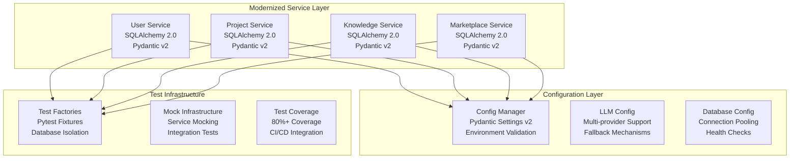

# Technical Debt Fixes Design Document

## Overview

This design addresses critical technical debt across the DesignSynapse microservices architecture through systematic modernization of database models, import structures, configuration management, test infrastructure, and dependency patterns. The solution maintains backward compatibility while establishing modern, maintainable patterns for future development.

## Architecture

### Current State Analysis

The system currently exhibits several technical debt patterns:
- Inconsistent SQLAlchemy patterns (mixing 1.x and 2.x approaches)
- Circular import issues in service modules
- Hardcoded configuration values and inconsistent environment variable usage
- Missing or incomplete test infrastructure
- Outdated dependency versions creating security and performance issues
- Weak service boundaries with direct database access between services

### Target Architecture



## Components and Interfaces

### 1. Database Model Modernization

#### SQLAlchemy 2.0 Migration Pattern
```python
# Modern SQLAlchemy 2.0 pattern with proper type hints
from sqlalchemy import Column, Integer, String, DateTime, ForeignKey
from sqlalchemy.orm import Mapped, mapped_column, relationship
from datetime import datetime

class ModernModel(Base):
    __tablename__ = "modern_models"
    
    # Type-annotated columns with mapped_column
    id: Mapped[int] = mapped_column(Integer, primary_key=True)
    name: Mapped[str] = mapped_column(String(255), nullable=False)
    created_at: Mapped[datetime] = mapped_column(DateTime, default=datetime.utcnow)
    
    # Proper relationship definitions
    related_items: Mapped[List["RelatedItem"]] = relationship(
        back_populates="parent",
        cascade="all, delete-orphan"
    )
```

#### Citation Model Fix
The Citation model requires proper foreign key constraints and cascade behavior:
```python
class Citation(Base):
    __tablename__ = "citations"
    
    id: Mapped[int] = mapped_column(Integer, primary_key=True)
    resource_id: Mapped[int] = mapped_column(
        Integer,
        ForeignKey("resources.id", ondelete="CASCADE"),
        nullable=False
    )
    project_id: Mapped[int] = mapped_column(Integer, nullable=False)
    context: Mapped[str] = mapped_column(Text, nullable=False)
    created_at: Mapped[datetime] = mapped_column(DateTime, default=datetime.utcnow)
    created_by: Mapped[int] = mapped_column(Integer, nullable=False, default=1)
    
    # Proper relationship with cascade
    resource: Mapped["Resource"] = relationship(
        "Resource",
        back_populates="citations"
    )
```

### 2. Import Structure Standardization

#### Module Organization Pattern
```
service/
├── __init__.py          # Public API exports only
├── models/
│   ├── __init__.py      # Model exports
│   ├── base.py          # Base model classes
│   └── specific.py      # Specific models
├── services/
│   ├── __init__.py      # Service exports
│   └── business_logic.py
├── api/
│   ├── __init__.py      # API exports
│   └── routes.py
└── core/
    ├── __init__.py      # Core exports
    ├── config.py        # Configuration
    └── dependencies.py  # Dependency injection
```

#### Import Resolution Strategy
- Use relative imports within services: `from .models import Model`
- Use absolute imports for cross-service communication via APIs
- Implement lazy loading for circular dependencies
- Create clear module boundaries with __init__.py exports

### 3. Configuration Management Modernization

#### Unified Configuration Pattern
```python
from pydantic_settings import BaseSettings, SettingsConfigDict
from typing import Optional, List
from enum import Enum

class Environment(str, Enum):
    DEVELOPMENT = "development"
    TESTING = "testing"
    PRODUCTION = "production"

class DatabaseConfig(BaseSettings):
    model_config = SettingsConfigDict(
        env_prefix="DB_",
        env_file=".env",
        case_sensitive=False
    )
    
    host: str = "localhost"
    port: int = 5432
    username: str
    password: str
    database: str
    pool_size: int = 10
    max_overflow: int = 20

class LLMConfig(BaseSettings):
    model_config = SettingsConfigDict(
        env_prefix="LLM_",
        env_file=".env"
    )
    
    primary_provider: str = "openai"
    openai_api_key: Optional[str] = None
    anthropic_api_key: Optional[str] = None
    fallback_providers: List[str] = ["anthropic"]
    max_retries: int = 3
    timeout: int = 30

class ServiceConfig(BaseSettings):
    model_config = SettingsConfigDict(env_file=".env")
    
    environment: Environment = Environment.DEVELOPMENT
    debug: bool = False
    database: DatabaseConfig = DatabaseConfig()
    llm: LLMConfig = LLMConfig()
```

#### Pinecone Configuration Fix
```python
class VectorConfig(BaseSettings):
    model_config = SettingsConfigDict(
        env_prefix="VECTOR_",
        env_file=".env"
    )
    
    pinecone_api_key: str
    pinecone_environment: str
    index_name: str = "knowledge-base"
    dimension: int = 384
    metric: str = "cosine"
    
    def validate_config(self) -> None:
        """Validate configuration on startup."""
        if not self.pinecone_api_key:
            raise ValueError("Pinecone API key is required")
        if not self.pinecone_environment:
            raise ValueError("Pinecone environment is required")
```

### 4. Test Infrastructure Design

#### Test Database Isolation
```python
# conftest.py - Shared test configuration
import pytest
from sqlalchemy import create_engine
from sqlalchemy.orm import sessionmaker
from testcontainers.postgres import PostgresContainer

@pytest.fixture(scope="session")
def test_db():
    """Create isolated test database."""
    with PostgresContainer("postgres:13") as postgres:
        engine = create_engine(postgres.get_connection_url())
        Base.metadata.create_all(engine)
        yield engine

@pytest.fixture
def db_session(test_db):
    """Create database session for tests."""
    Session = sessionmaker(bind=test_db)
    session = Session()
    try:
        yield session
    finally:
        session.rollback()
        session.close()
```

#### Factory Pattern for Test Data
```python
# factories.py - Test data factories
import factory
from factory.alchemy import SQLAlchemyModelFactory
from models import User, Resource, Citation

class UserFactory(SQLAlchemyModelFactory):
    class Meta:
        model = User
        sqlalchemy_session_persistence = "commit"
    
    email = factory.Sequence(lambda n: f"user{n}@example.com")
    username = factory.Sequence(lambda n: f"user{n}")
    password = "testpassword123"
    first_name = factory.Faker("first_name")
    last_name = factory.Faker("last_name")

class ResourceFactory(SQLAlchemyModelFactory):
    class Meta:
        model = Resource
        sqlalchemy_session_persistence = "commit"
    
    title = factory.Faker("sentence", nb_words=4)
    description = factory.Faker("text", max_nb_chars=500)
    content_type = "pdf"
    source_url = factory.Faker("url")
    storage_path = factory.Faker("file_path")
```

#### Service Mocking Strategy
```python
# test_mocks.py - Service mocking utilities
from unittest.mock import AsyncMock, MagicMock
import pytest

@pytest.fixture
def mock_llm_service():
    """Mock LLM service for testing."""
    mock = AsyncMock()
    mock.generate_insights.return_value = (
        "Test summary",
        ["Key point 1", "Key point 2"],
        ["keyword1", "keyword2"]
    )
    return mock

@pytest.fixture
def mock_vector_service():
    """Mock vector search service."""
    mock = MagicMock()
    mock.search.return_value = [
        {"id": 1, "score": 0.95, "metadata": {"title": "Test Resource"}}
    ]
    return mock
```

### 5. Dependency Modernization Strategy

#### SQLAlchemy 2.0 Migration
- Update all model definitions to use `Mapped` type annotations
- Replace `relationship()` with proper type hints
- Update query patterns to use SQLAlchemy 2.0 syntax
- Implement proper async support where needed

#### Pydantic v2 Migration
```python
# Modern Pydantic v2 patterns
from pydantic import BaseModel, Field, ConfigDict
from typing import Optional
from datetime import datetime

class ResourceSchema(BaseModel):
    model_config = ConfigDict(from_attributes=True)
    
    id: int
    title: str = Field(..., min_length=1, max_length=255)
    description: str = Field(..., min_length=1, max_length=1000)
    content_type: str
    source_url: str = Field(..., pattern=r'^https?://.+')
    created_at: datetime
    updated_at: datetime
    
    # Computed fields
    @property
    def display_title(self) -> str:
        return self.title.title()
```

## Data Models

### Updated Resource Model
```python
from sqlalchemy import Column, Integer, String, Text, DateTime, JSON, CheckConstraint
from sqlalchemy.orm import Mapped, mapped_column, relationship
from datetime import datetime
from typing import List, Optional, Dict, Any

class Resource(Base):
    __tablename__ = "resources"
    
    id: Mapped[int] = mapped_column(Integer, primary_key=True)
    title: Mapped[str] = mapped_column(String(255), nullable=False)
    description: Mapped[str] = mapped_column(String(1000), nullable=False)
    content_type: Mapped[str] = mapped_column(String(50), nullable=False)
    source_url: Mapped[str] = mapped_column(String(500), nullable=False)
    source_platform: Mapped[Optional[str]] = mapped_column(String(100))
    vector_embedding: Mapped[Optional[Dict[str, Any]]] = mapped_column(JSON)
    
    # Metadata fields
    author: Mapped[Optional[str]] = mapped_column(String(255))
    publication_date: Mapped[Optional[datetime]] = mapped_column(DateTime)
    doi: Mapped[Optional[str]] = mapped_column(String(100))
    license_type: Mapped[Optional[str]] = mapped_column(String(100))
    
    # Generated content
    summary: Mapped[Optional[str]] = mapped_column(Text)
    key_takeaways: Mapped[Optional[List[str]]] = mapped_column(JSON)
    keywords: Mapped[Optional[List[str]]] = mapped_column(JSON)
    
    # Storage info
    storage_path: Mapped[str] = mapped_column(String(500), nullable=False)
    file_size: Mapped[Optional[int]] = mapped_column(
        Integer,
        CheckConstraint('file_size >= 0', name='check_file_size_positive')
    )
    
    # Timestamps
    created_at: Mapped[datetime] = mapped_column(DateTime, default=datetime.utcnow)
    updated_at: Mapped[datetime] = mapped_column(
        DateTime,
        default=datetime.utcnow,
        onupdate=datetime.utcnow
    )
    
    # Relationships
    bookmarks: Mapped[List["Bookmark"]] = relationship(
        back_populates="resource",
        cascade="all, delete-orphan"
    )
    citations: Mapped[List["Citation"]] = relationship(
        back_populates="resource",
        cascade="all, delete-orphan"
    )
```

## Error Handling

### Standardized Error Response Pattern
```python
from pydantic import BaseModel
from typing import Optional, List, Dict, Any
from enum import Enum

class ErrorType(str, Enum):
    VALIDATION_ERROR = "validation_error"
    NOT_FOUND = "not_found"
    PERMISSION_DENIED = "permission_denied"
    INTERNAL_ERROR = "internal_error"
    EXTERNAL_SERVICE_ERROR = "external_service_error"

class ErrorDetail(BaseModel):
    field: Optional[str] = None
    message: str
    code: Optional[str] = None

class StandardErrorResponse(BaseModel):
    error_type: ErrorType
    message: str
    details: Optional[List[ErrorDetail]] = None
    request_id: Optional[str] = None
    timestamp: datetime
    
    @classmethod
    def validation_error(
        cls,
        message: str,
        details: List[ErrorDetail],
        request_id: Optional[str] = None
    ) -> "StandardErrorResponse":
        return cls(
            error_type=ErrorType.VALIDATION_ERROR,
            message=message,
            details=details,
            request_id=request_id,
            timestamp=datetime.utcnow()
        )
```

### Database Error Handling
```python
from sqlalchemy.exc import IntegrityError, SQLAlchemyError
from fastapi import HTTPException

async def handle_database_errors(func):
    """Decorator for consistent database error handling."""
    try:
        return await func()
    except IntegrityError as e:
        if "foreign key constraint" in str(e):
            raise HTTPException(
                status_code=400,
                detail=StandardErrorResponse.validation_error(
                    message="Referenced resource does not exist",
                    details=[ErrorDetail(message=str(e))]
                ).dict()
            )
        raise HTTPException(
            status_code=400,
            detail=StandardErrorResponse.validation_error(
                message="Data integrity violation",
                details=[ErrorDetail(message=str(e))]
            ).dict()
        )
    except SQLAlchemyError as e:
        raise HTTPException(
            status_code=500,
            detail=StandardErrorResponse(
                error_type=ErrorType.INTERNAL_ERROR,
                message="Database operation failed",
                timestamp=datetime.utcnow()
            ).dict()
        )
```

## Testing Strategy

### Test Coverage Requirements
- Unit tests: 90%+ coverage for business logic
- Integration tests: 80%+ coverage for API endpoints
- End-to-end tests: Critical user journeys
- Performance tests: Database query optimization
- Security tests: Authentication and authorization

### Test Organization
```
tests/
├── unit/
│   ├── models/
│   ├── services/
│   └── utils/
├── integration/
│   ├── api/
│   └── database/
├── e2e/
│   └── user_journeys/
├── fixtures/
│   ├── factories.py
│   └── data/
└── conftest.py
```

### Continuous Integration
- Automated test execution on PR creation
- Code coverage reporting
- Database migration testing
- Security vulnerability scanning
- Performance regression testing

## Migration Strategy

### Phase 1: Foundation (Week 1-2)
1. Update dependency versions in requirements.txt files
2. Create unified configuration management system
3. Establish test infrastructure with database isolation
4. Fix critical import circular dependencies

### Phase 2: Model Modernization (Week 3-4)
1. Migrate SQLAlchemy models to 2.0 patterns
2. Fix Citation model foreign key constraints
3. Update Pydantic schemas to v2
4. Implement proper validation patterns

### Phase 3: Service Boundaries (Week 5-6)
1. Remove direct database access between services
2. Implement proper API communication patterns
3. Add service health checks and monitoring
4. Update error handling to use standard patterns

### Phase 4: Testing and Validation (Week 7-8)
1. Achieve target test coverage
2. Performance testing and optimization
3. Security audit and fixes
4. Documentation updates

## Rollback Strategy

Each phase includes rollback procedures:
- Database migration rollback scripts
- Configuration rollback procedures
- Service deployment rollback
- Monitoring and alerting for issues

## Success Metrics

- Zero circular import errors
- 90%+ test coverage for critical paths
- Sub-200ms API response times maintained
- Zero database constraint violations
- Successful CI/CD pipeline execution
- Developer productivity improvements measured